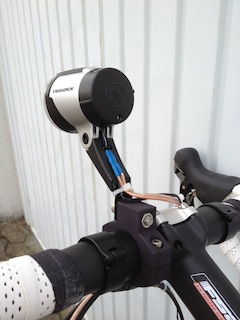
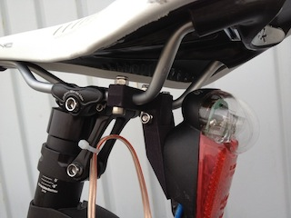
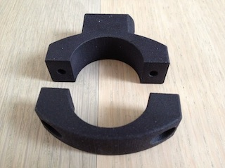
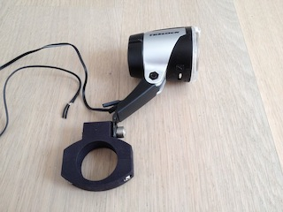
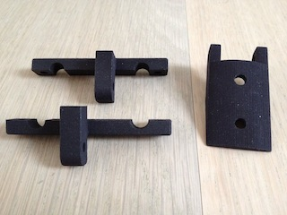
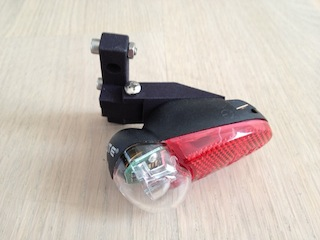

+++
title = "Lamp brackets for my cyclocross bicycle"
date = 2012-02-07
[taxonomies]
categories = ["cad"]
[extra]
shortlink = "4218b8ec"
+++
**Update
The drawings are now available online, see my [blogpost](@/2015/bicycle-parts-onshape/index.md).
Update**

My new cyclocross bicycle needed lighting, because it is used everyday for my way to work.
It is equipped with a hub dynamo but does not have mounting holes for lights.

Because i did not find anything useful, i created my own lamp brackets.

<!-- more -->

The brackets are designed to fit the following lamps:

* Trelock LS 885
* B&M Seculite plus

if you need a copy of them, you can

* download the CAD drawings for [Rhino3D](https://www.rhino3d.com) and change it according to your needs.
* [Vorderlichthalter.3dm](Vorderlichthalter.3dm)
* [Ruecklichthalter.3dm](Ruecklichthalter.3dm)

* download the STL files and print it for yourself, i.e. with a [Ultimaker](https://www.ultimaker.com).
* [lampenhalter_vorne_oben.stl](lampenhalter_vorne_oben.stl)
* [lampenhalter_vorne_unten.stl](lampenhalter_vorne_unten.stl)
* [lampenhalter_hinten.stl](lampenhalter_hinten.stl)
* [sattelhalter_oben.stl](sattelhalter_oben.stl)
* [sattelhalter_unten.stl](sattelhalter_unten.stl)

get the printed parts from my Shop at
[Shapeways](http://www.shapeways.com/shops/uwearzt?section=3061).
They provide different colors matching the colors of your bicylcle.

### Front bracket

### Back bracket

