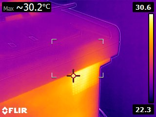
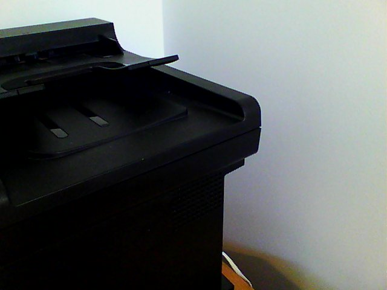

+++
title = "FLIR E4 E8"
date = 2013-12-23

aliases = [
  "4215cd32"
]

[taxonomies]
categories = ["electronic"]
+++

I have bought a FLIR E4 Thermal Camera and Firmware upgraded it to a E8. Very nice Thermal camera. I will use it to test my currently build Reflow Oven,
and have some other fun with it (What about IR Skype?).

<!-- more -->

One nice feature is that you get a standard photo together with the thermal image:

And BTW my printer is sucking to much energy...

Here the review video from Mike:
{{ youtube(id="C3YksbvYnKY") }}

And here the teardown video from Mike (you should definitely subscribe Mikes channel):
{{ youtube(id="NtqUE67BUDI") }}

The complete EEVForum Thread for the FLIR E4:
[EEVBlog Forum: Teardown FLIR E4](https://www.eevblog.com/forum/testgear/flir-e4-thermal-imaging-camera-teardown/).

The exact description how to ugrade from E4 to E8:
[EEVBlog Forum: How to upgrade E4 - E8](https://www.eevblog.com/forum/testgear/flir-e4-thermal-imaging-camera-teardown/msg321956/#msg321956).

