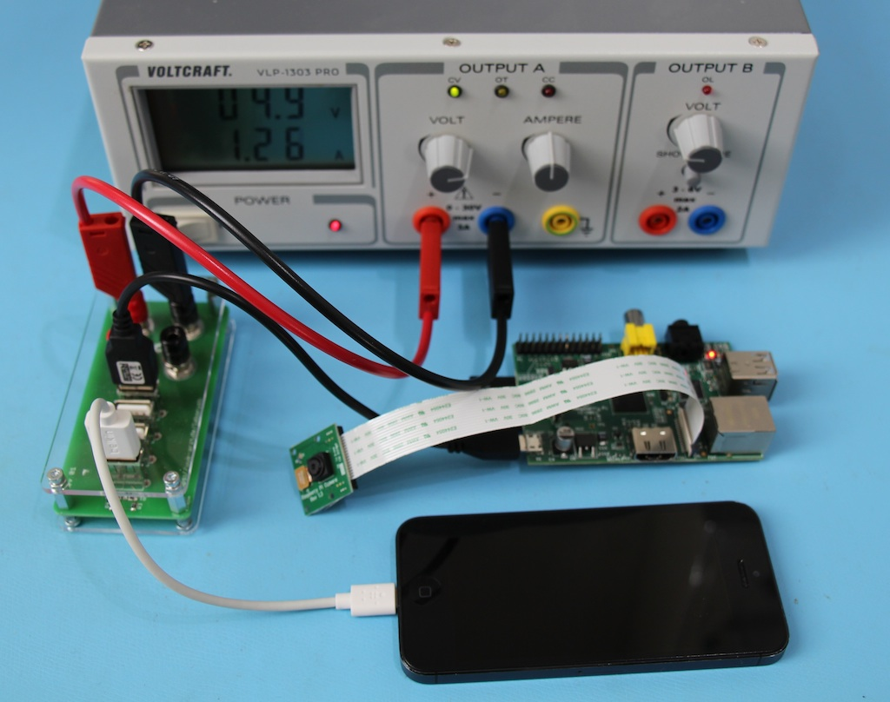

+++
title = "LaborUSB finished"
date = 2013-10-05
[taxonomies]
categories = ["electronic"]
[extra]
shortlink = "4268c677"
+++

Many prototyping boards these days use USB Connectors as Power Source. For easy powering
those devices with my DC Power Supply (or in german “Labornetzteil”) i created a adaptor
from 4 mm banana plugs to 4 USB Jacks.

<!-- more -->

Here it is in action:

For a complete project description, or if you would like to build your own, see
[LaborUSB](https://github.com/uwearzt/LaborUSB).
