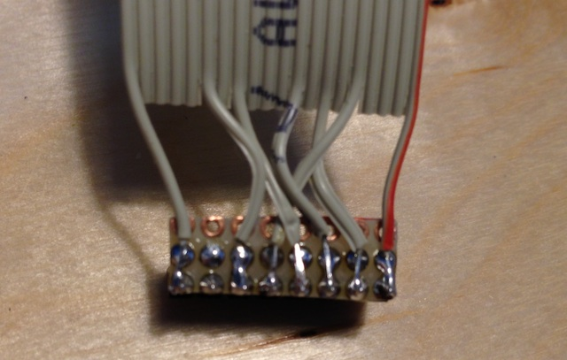
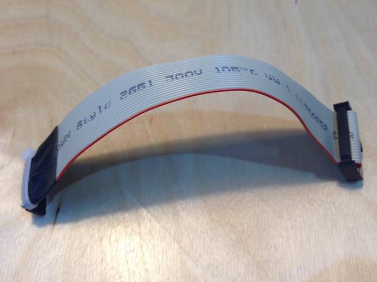

+++
title = "LPCXpresso LPC1769 commandline Development on Mac OS X"
date = 2013-01-15

aliases = [
  "424c3fb4"
]

[taxonomies]
categories = ["arm"]
+++
Because editing with [vim](http://www.vim.org) is my preferred way of creating software, i do
not use the Eclipse based software delivered together with the LPCXpresso.

Here i describe, what is necessary to compile, flash and debug the LPCXpresso with the
FreeRTOS blinking example from the commandline with:

* <s>LPCXpresso 1769</s>
* [Segger J-Link](https://www.segger.com/j-link-edu.html)
* [ARM gcc compiler chain](https://launchpad.net/gcc-arm-embedded/+download)
* [vim](http://www.vim.org)
* [cmake](https://www.cmake.org)
* [Breadboard Power Supply](https://www.sparkfun.com/products/8376)
* [FreeRTOS](https://www.freertos.org)

<!-- more -->

### Preparation of the LPCXpresso

Cut off the LPC-Link (this one only works with the CodeRed IDE) and solder Pinheaders to the
JTAG Interface and the socket connectors for using the LPCXpresso in a Breadboard.


### JTAG cable

Wire an JTAG Adapter cable for the connection between the J-Link and the LPCXpresso.

|       | J-Link | LPCXpresso |
|-------|--------|------------|
| VTRef |      1 |          1 |
| TMS   |      7 |          2 |
| TCK   |      9 |          3 |
| TDO   |     13 |          4 |
| TDI   |      5 |          5 |
| RESET |     15 |          6 |
|       |     nc |         nc |
| GND   |     20 |          8 |

The easiest solution is to take a ribbon cable, and cut all non necessary wires. Then solder
the remaining wires to 8-pin female header and a small piece of prototyoe board.


I covered the the prototype board with duct tape and use a cable tie as strain relief.


### Plug the hardware together

For our the Demo you need an additional power supply. If you use the original LPC-Link,
power is provided through the USB on the LPC-Link. You need 3.3V, basically every power
supply with 3.3V will work.


### Installation of compiler and gdbserver

Download the arm-gcc package for Mac OS X (which is provided by ARM) and the gdbserver
from the links above. I have installed both under the /opt directory. If you choose a
different installation directory, the path settings in the demo project must be changed
accordingly.

### Installation of cmake

One of the easiest ways is to install [macports](https://www.macports.org) and compile cmake with

```bash
sudo port install cmake
```

afterwards.

### Compile and start RTOS Example

Download the [example](FreeRTOSDemo.tar.bz2) and extract it with

```bash
tar jxf FreeRTOSDemo.tar.bz2
```

Step into the build directory

```bash
cd FreeRTOSDemo/build
```

Generate Makefiles from the projectdefinition and build the project

```bash
cmake .. ; make
```

Start the gdbserver creating a connection to the J-LINK with

```bash
make gdbserver
```

In a second windows start gdb, which executes a provided command file to load the
FreeRTOSDemo into the flash memory, afterthat sets a breakpoint at main() and executes
the program.

```bash
make gdb
```

You can also type in the steps one by one, which allows to see what is happening on the
JTAG adapter with a logic analyzer.

```txt
target remote localhost:2331
monitor interface SWD
monitor reset
monitor flash device = LPC1769
monitor flash download = 1
monitor flash breakpoints = 1
file "FreeRTOSTest.elf"
load
monitor reg r13 = 0x00000000
monitor reg pc = 0x00000004
break main
monitor reset
continue
```


<div class="comments">
<hr class="comments-ruler" />
<div class="comments-level-1">
<p class="comments-author">Michael Ring says</p>
<p class="comments-date">2013/05/13</p>
<p>
One possible optimization is to use the on board power supply of the J-Link Adapter on
pin19 of the JTAG connector. Then you only need a TS1117 low drop voltage regulator and
two 10uF capacitors and you have 3.3Volts supply voltage available.
</p>
<p>
Or, even more simple, you simple do not cut the board in pieces and simply remove the
small solder bridges from pin two to pin 6. You can then use the original USB-connector
of the lpc-link to supply the 3.3 Volts on Pin 1 and 8(GND), you also then have
5 Volts available through pin 7.
</p>
</div>
</div>
