+++
title = "iOS GnuPG Clients"
date = 2014-12-30

aliases = [
  "/2014/12/30/ios-gnupg-clients/",
  "/2014/12/30/ios-gnupg-clients/index.html",
  "4297d152"
]

[taxonomies]
 categories = ["ios", "security"]
+++
On my Mac i already use GnuPG a lot (basically all my messages are signed, and some of them
encrypted). But because nowadays i do a good amount of work on my iPad an iPhone, is had to
search for a GnuPG solution on iOS too.

<!-- more -->

# Clients

|   | Name | Price |
|---|------|---|
|  | [iPGMail](https://itunes.apple.com/de/app/ipgmail/id430780873?mt=8) | 1,79 EUR |
|  | <s>oPenGP</s> | 4,49 EUR |
|  | <s>Secumail</s> | 44,99 EUR |
|  | <s>NouveauPG</s> | 2,69 EUR |

All programs where tested on iOS 8.1.2 with a iPhone 6 and a iPad Mini Retina. All programs
except NouveauPG are Universal Apps and optimized fordifferent screen sizes.

# Test Matrix

the programs where tested against this test matrix. I started at the top and proceeded
to the bottom. Secumail and NouveauPG are disqualified, because it is not possible to
exchange the private Key over iTunes, and you should never copy your private key to
a Cloud Storage (even with a good passphrase).

For the remaining programs i have tested if the functionality works, and then got my own
opinion if the integration in iOS is felicitous.

|                          | iPGMail | oPenGP | Secumail | NouveauPG |
|--------------------------|---|---|---|---|
| **Keyhandling**          | | | | |
| Generate Key pair        | yes | no | no | yes |
| Private Key transfer     | iTunes, Dropbox, iCloud, Clipboard | iTunes, Dropbox, Clipboard | Dropbox, Clipboard | Clipboard |
| Public Key transfer      | same + Keyserver | same + Keyserver | same + Keyserver | same |
| Upload key to Keyserver  | yes | no | no | no |
| Own Keyserver possible   | yes | yes | yes (no preset) | no |
| Needs access to contacts | no | yes (searches for keys of contact EMail only) | no | no |
| Save passphrases         | no | Keychain | --- | --- |
| **Decryption**           | | | | |
| Integration in Mail      | Share, good | Share, good | --- | --- |
| **Signing**              | | | | |
| Single receiver          | ok, good | ok, bad | --- | --- |
| Multiple receivers       | ok, good | ok, bad | --- | --- |
| **Encryption**           | | | | |
| Single receiver          | ok, good | ok, bad | --- | --- |
| Multiple receivers       | ok, good | ok, bad | --- | --- |
| **Attachments**          | | | | |
| Receiving                | ok | ok | --- | --- |
| Sending                  | ok | ok | --- | --- |
| **Compatibility**        | | | | |
| Apple Mail               | yes | yes | --- | --- |
| Outlook (Windows)        | yes | yes | --- | --- |
| Thunderbird + Enigmail   | yes | yes | --- | --- |
| Android                  | yes | yes | --- | --- |
| inline PGP               | yes | yes | --- | --- |
| PGP/Mime                 | yes | yes | --- | --- |

# Conclusions

The usage of GnuPG on the iPhone is not as usable as on other devices. It works with some
hassle, but for a widespread use of GnuPG on iOS, Apple has to allow plugins in the
iOS Mail program.

In my opinion, the cheapest App (iPGMail) is the way to go.

# Recommendations

- Always use iTunes for Key transfer (not Dropbox or iCloud)
- Do not generate your key pair on the iPhone (unknown RNG)

# How to use iPGMail

## Copy your private Key

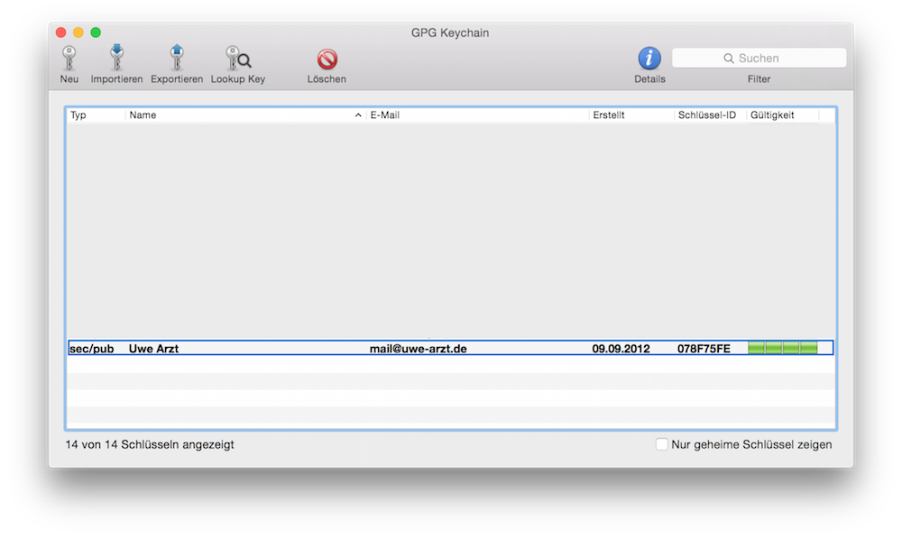

Find the key to export to the iPhone.

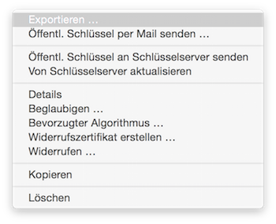

Select Export (Exportieren in german language).

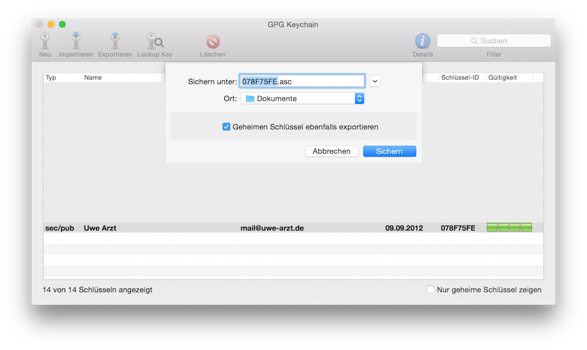

Do not forget to export your private key too (Geheimer Schlüssel in german language).

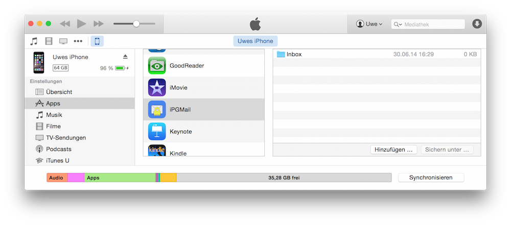

In the Apps Section you have to completely scroll down until you see the section where you can copy
files to the iPhone/iPad. There you have to select iPGMail and click add (Hinzuf&uuml;gen in
german Language).

Select your exported keys and click add.

Start a sync which will copy the Key over to the iOS Device.

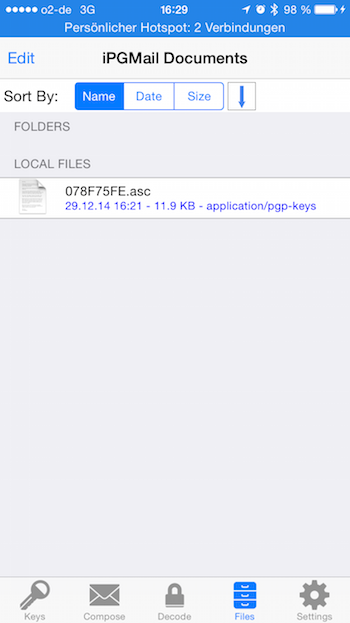

In iPGMail select the files Tab and tap on your Key file.

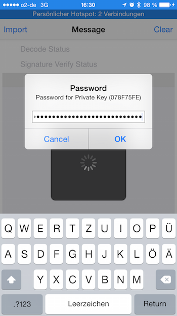

You have to provide your password (hopefully a good one).

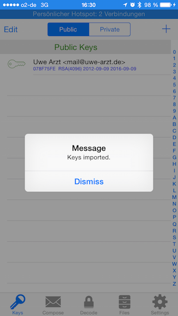

If everything worked, the keys are imported.

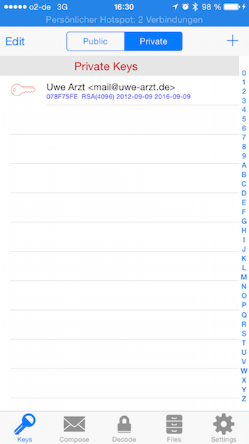

Check if your private keys was imorted too.

## Getting a public key

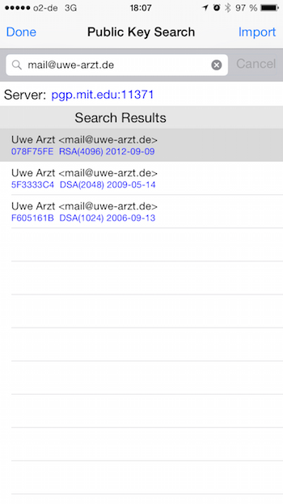

Search them on the keyserver (there are already keyservers predefined, but you can use your
own too, i.e. for company environments).

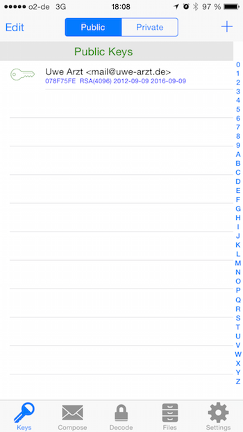

Tap on the key to download.

## Sending a signed and encryted EMail

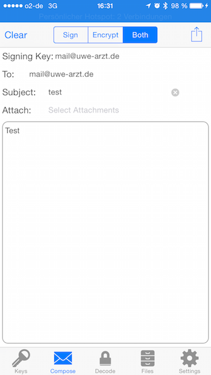

Start iPGMail and go to the compose tab. You can select a key which is used for signing
(your own key) and a public key for encryption (the public receiver key). Then you can type
your subject and your message. After that, click on the send icon in the upper right corner.

Select "Send EMail" for creating a EMail directly.

The receiver is picked up from the public key you haven chosen before. **Send**.

## Reading an encrypted EMail

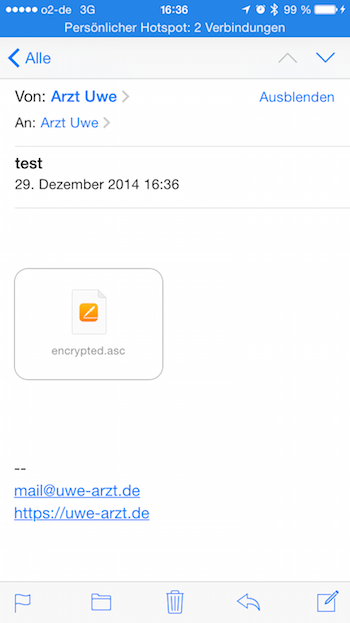

In a received EMail you have a encrypted Attachment.
Tap on the Attachment and you have the encrypted text.

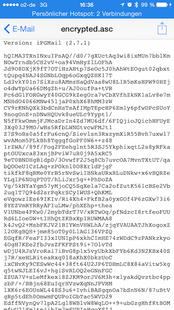

Tap on the Share Button in the upper right corner.

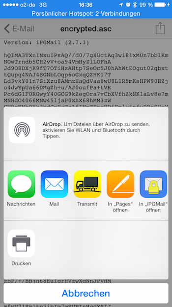

And choose iPGMail.

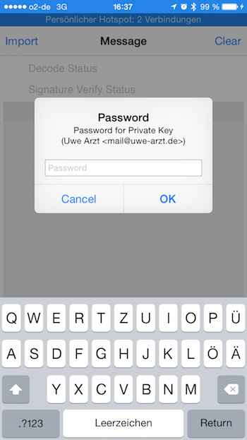

Provide the password for your key.

And you get a list of all decrypted parts (text, attachments).

Tap on the text, and here we are.
