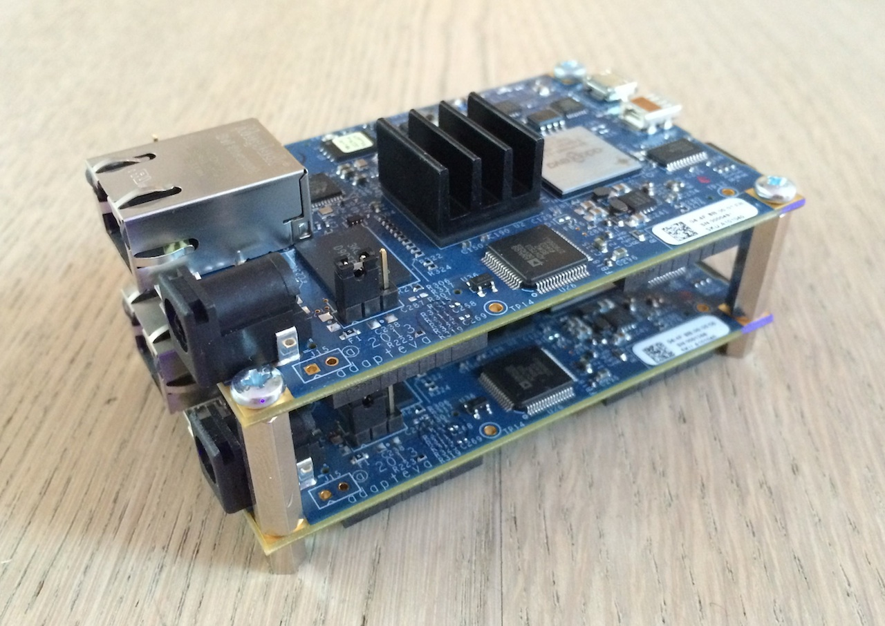

+++
title = "Parallella Boards"
date = 2014-04-10

aliases = [
  "42f81b3b"
]

[taxonomies]
categories = ["other"]
+++

I've got my two <s>Parallella</s> Boards from the [Parallella Kickstarter Campaign](https://www.kickstarter.com/projects/adapteva/parallella-a-supercomputer-for-everyone).

<!-- more -->

So far i have only installed Ubuntu on the two boards and run some sample programs. Looks like they have quite impressive performance.

