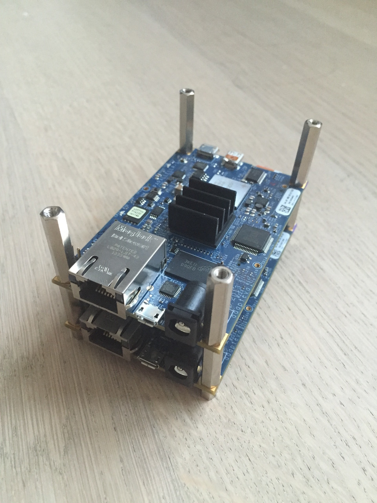
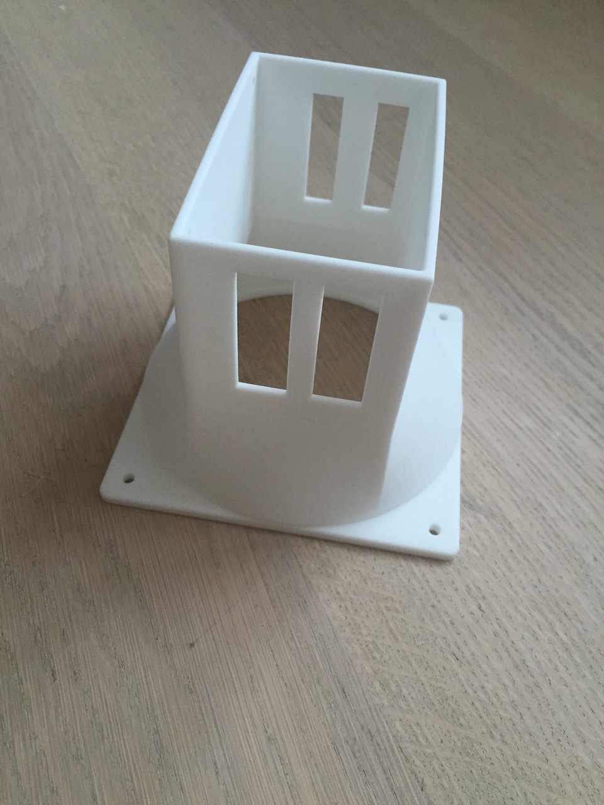
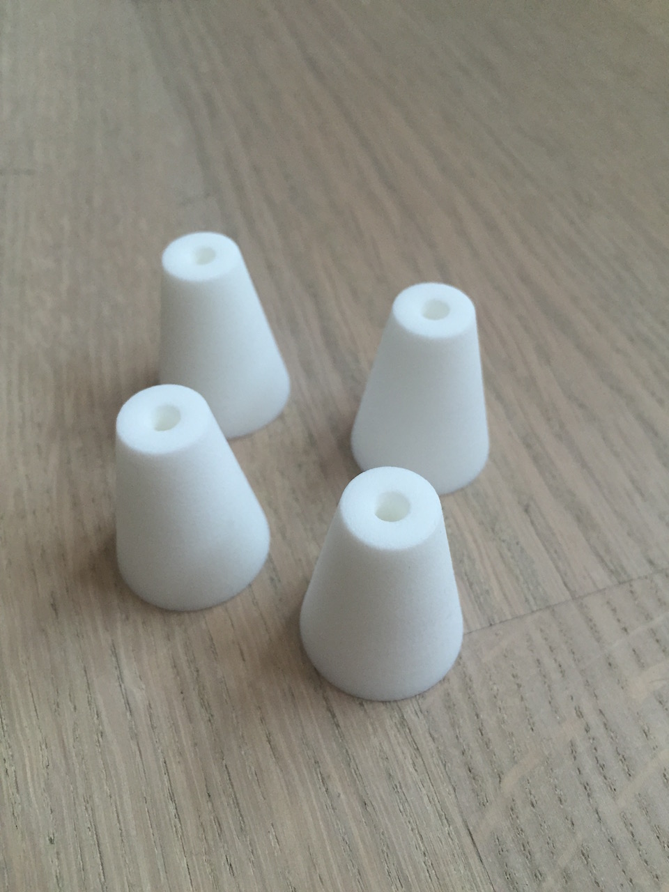
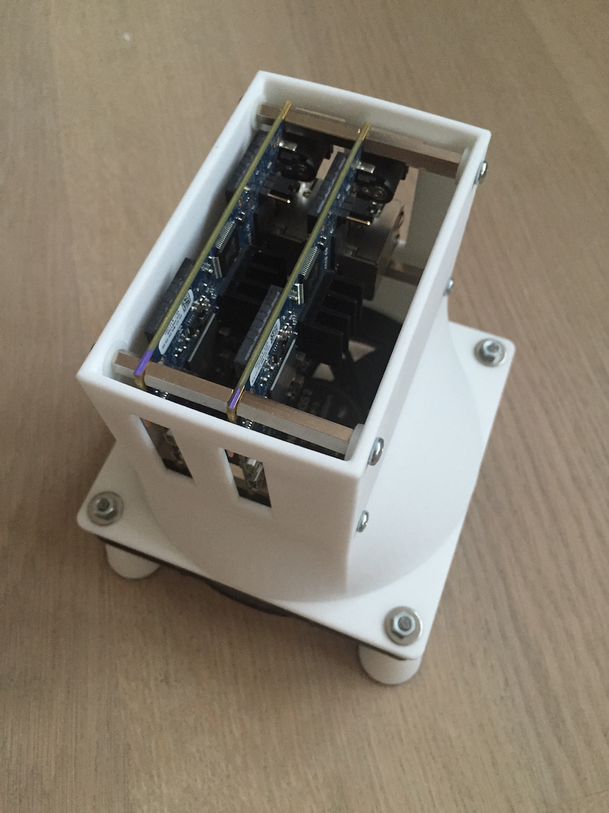
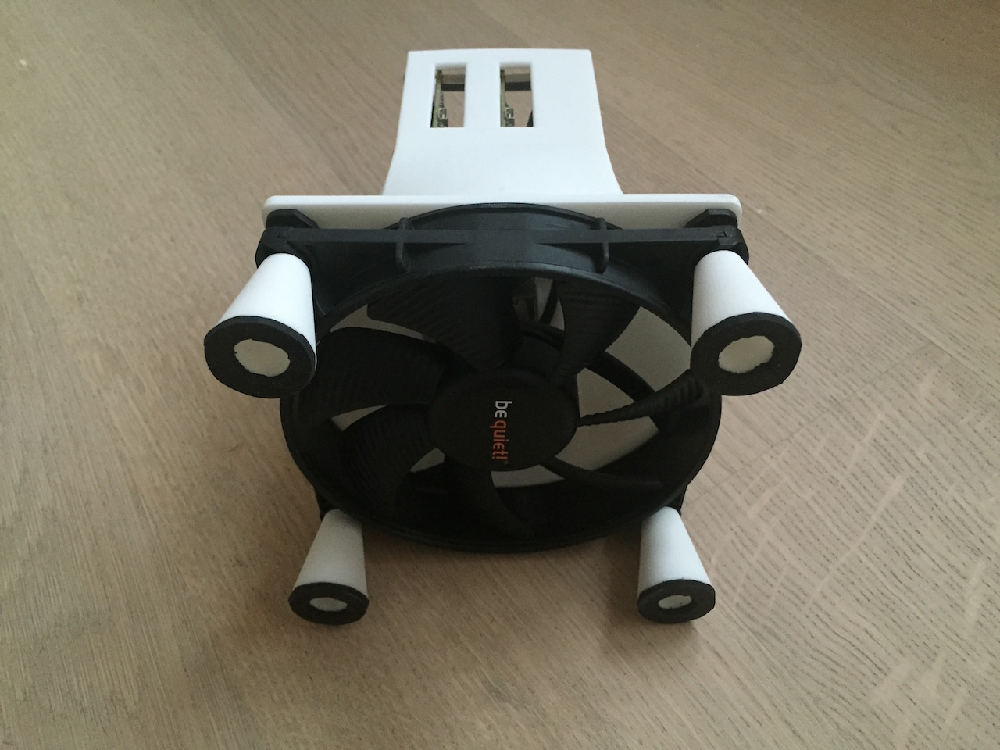

+++
title = "Parallela on supercomputer.io"
date = 2015-10-03

aliases = [
  "42694528"
]

[taxonomies]
categories = ["other"]
+++

<s>Parallella</s> has started a distributed Supercomputer on
<s>supercomputer.io</s> with their parallela chips. I decided to
put my two Kickstarter Parallelas inside a cooling case and let them participate.

<!-- more -->

If you like to build your own, you can print the STL files

* [Air Channel](AirChannel.stl)
* [Standoff](Standoff.stl) (4 times)

or you can get the CAD files from <s>Onshape</s> and change it according to your needs.

## Assembling

Boards mounted with spacers.

The Air channel as delivered from Shapeways.

The standoffs as delivered from Shapeways.

Everything mounted together.

View from the bottom with the (quiet) fan.
