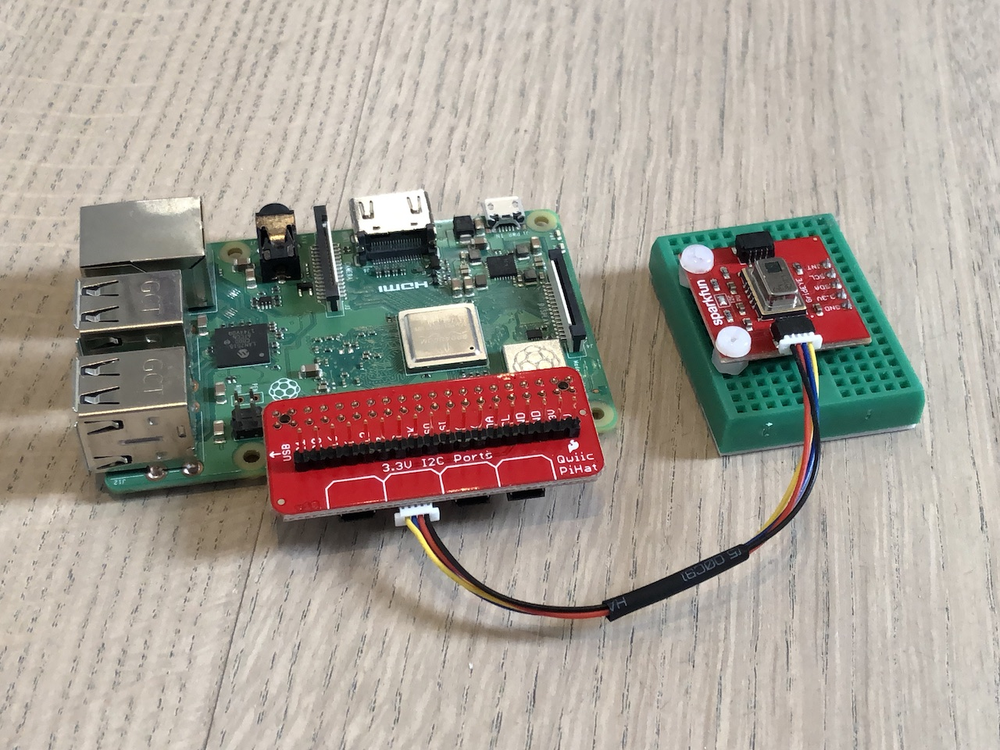
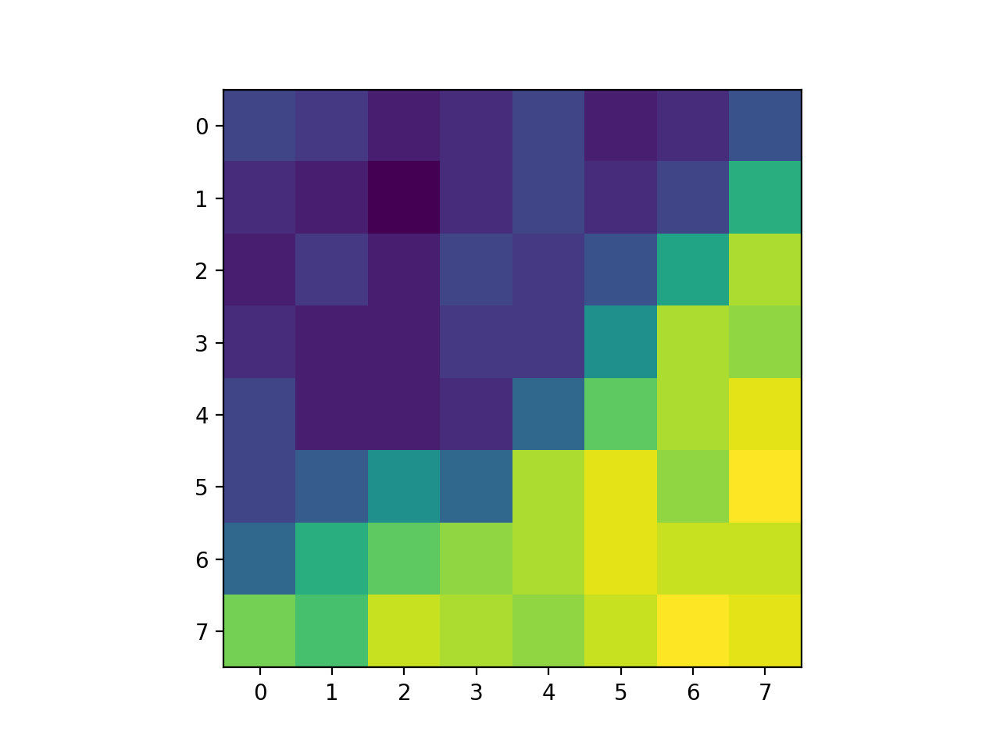

+++
title = "Rust driver for Grid-EYE"
date = 2018-12-20

aliases = [
  "424a32b1"
]

[taxonomies]
categories = ["rust"]
+++

there is now a driver for the Grid-EYE / Panasonic AMG88(33) sensor available at
[crates.io](https://crates.io/crates/grideye) / [github](https://github.com/uwearzt/grideye).

It uses the [embedded_hal](https://crates.io/crates/embedded-hal), here is my test setup

<!-- more -->



It uses the

* [Sparkfun Qwiic Hat](https://www.sparkfun.com/products/14459)
* [SparkFun Grid-EYE Infrared Array Breakout](https://www.sparkfun.com/products/14607)

## Example output

```csv
30.5;30.25;29.75;30;30.5;29.75;30;30.75
30;29.75;29.25;30;30.5;30;30.5;33
29.75;30.25;29.75;30.5;30.25;30.75;32.75;34.5
30;29.75;29.75;30.25;30.25;32.25;34.5;34.25
30.5;29.75;29.75;30;31.25;33.75;34.5;35
30.5;31;32.25;31.25;34.5;35;34.25;35.25
31.25;33;33.75;34.25;34.5;35;34.75;34.75
34;33.5;34.75;34.5;34.25;34.75;35.25;35
```

## Generated heatmap


