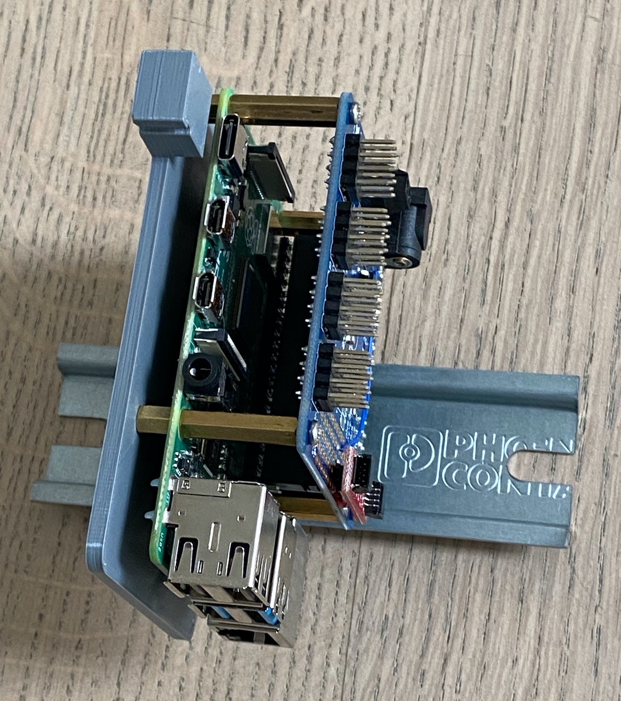
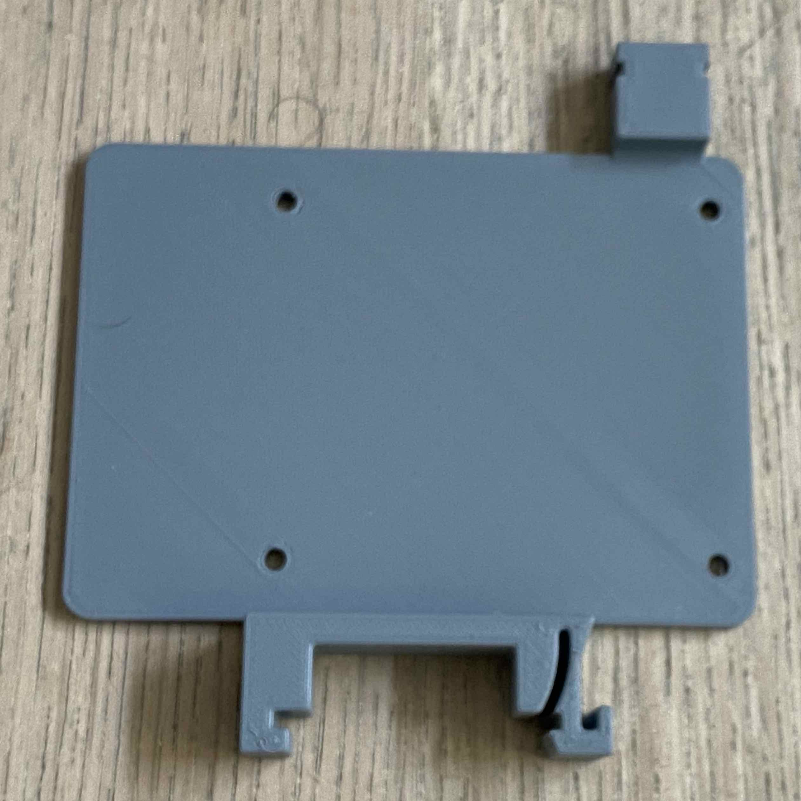

+++
title = "Raspberry Pi 4 mount for DIN Rails"
date = 2020-06-12

aliases = [
  "424a64d1"
]

[taxonomies]
 categories = ["cad"]
+++

If you are in need of a Raspberry Pi 4 Mounting plate for DIN rails, you can get the one i have
created.

<!-- more -->

The plate without Raspberry Pi

You can download the
[Fusion 360](https://github.com/uwearzt/fusion360/blob/master/parts/Lab/RaspberryPi/DINRailMount.f3d)
or [Step](https://github.com/uwearzt/fusion360/blob/master/parts/Lab/RaspberryPi/DINRailMount.step)
files from my github repo, or get the
[STL](https://www.prusaprinters.org/prints/34223-raspberry-pi-4-din-rail-mount).
