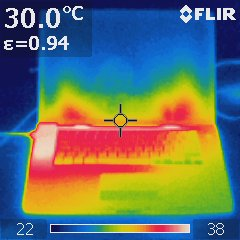
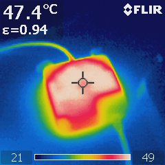

title: Thermal Image MacBook Pro
categories:
  - Mac OS X
published_date: "2010-03-18 00:00:00 +0100"
layout: post.liquid
data:
  type: blog
  shortlink: 42e5a4a9
---
We had a Thermal Image Photosession for our home last week. I have also 
made an Thermal Image of my Macbook Pro.

Now i know, why my legs feel hot while working with my Mac ;). The Power Supply
is getting hot too... The colors are not scaled to the same temperatures
(see the temperature bar at the bottom with min and max temperature).

<!-- more -->

If you need aditional informations about Thermal Images or other Measurements
for your home, see (in german language) <http://www.biomess.de> and <http://www.obeloer.de>.
