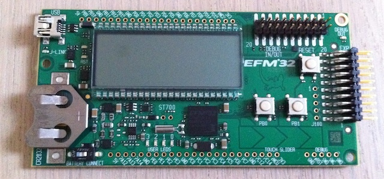

I will use the [Energy Micro](http://www.energymicro.com) EFM32 Gecko as Microcontroller for my
RoomSensor (and in general the Cortex M Architecture many of my future projects).

For testing purposes i have bought the [Starterkit](http://www.energymicro.com/tools/efm32-gecko-starter-kit)
from [Energy Micro](http://www.energymicro.com).

<!-- more -->

