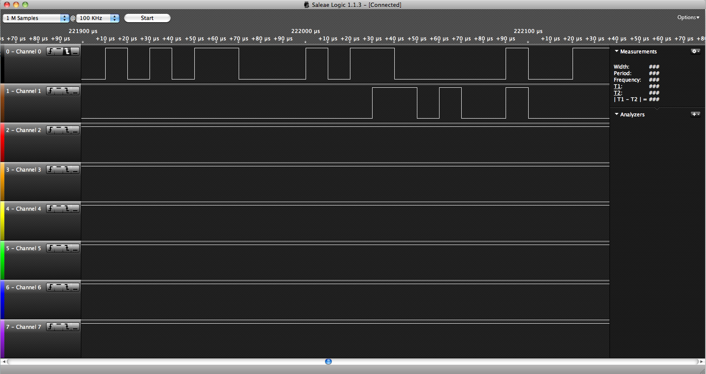
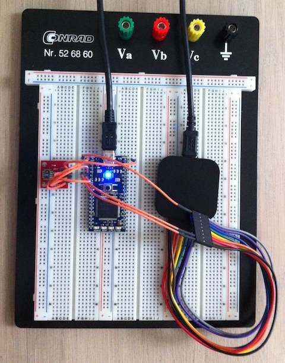

title: USB Logic Analyzer
categories:
  - Electronics
published_date: "2010-10-16 00:00:00 +0100"
layout: post.liquid
data:
  type: blog
  shortlink: 427b4c4e
---
i needed an Logic Analyzer for testing microcontroller to pheripheral communication. I decided to buy "Logic" from [Saleae](http://www.saleae.com).
It is fast enough for most microcontroller related measurements, very small and it comes with Mac OS X software.

<!-- more -->

The screenshot you see here is the communication between an LPC1786 microcontroller and an SHT15 temperatur and humidity sensor.

When you look on the breadboard together with an [mbed prototyping board](http://mbed.org) you can see how small Logic really is.

