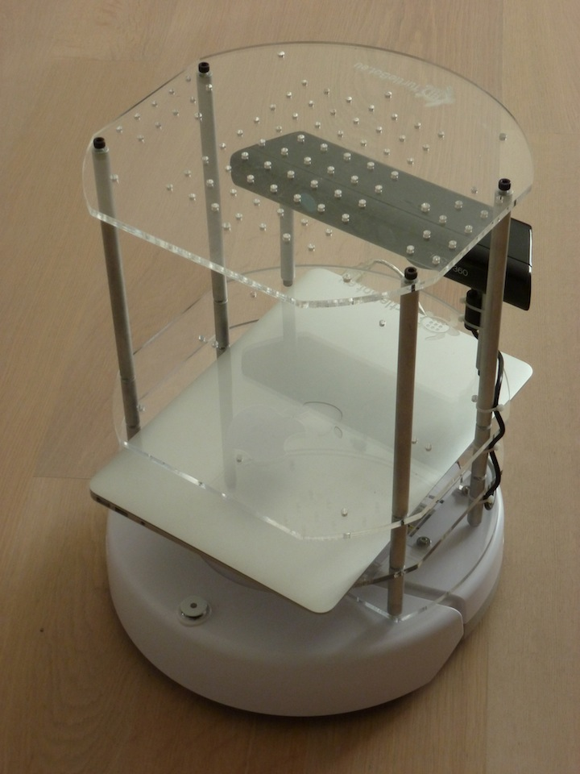
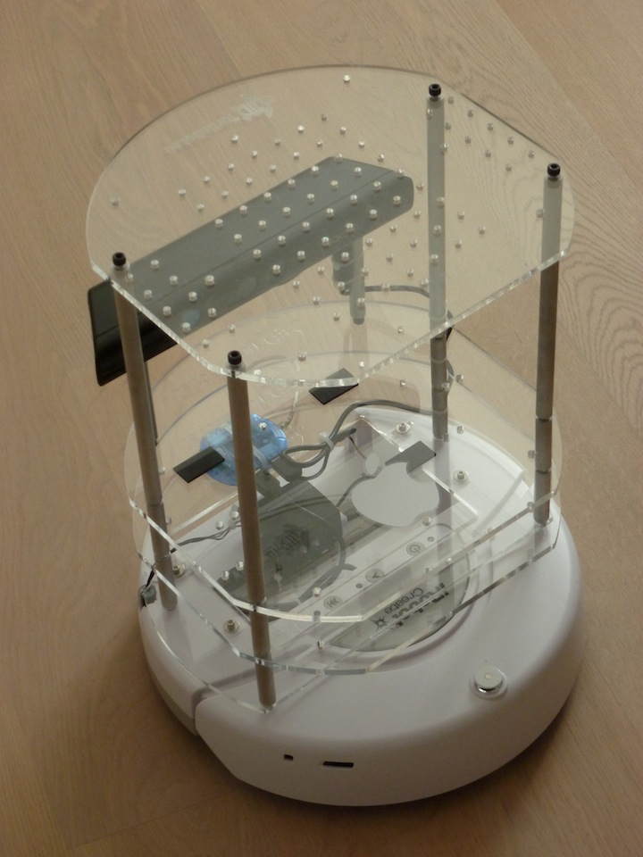

extends: post.liquid

title: Turtlebot with MacBook Air
date: 03 Oct 2011 00:00:00 +0100
type: "blog"
categories: ["Robotics", "ROS"]
---

Turtlebot was powered up for the first time today. In contrast to the original Turtlebot, it has an Macbook Air instead of an Asus Netbook 1215N.

At the moment ROS is installed on a virtual Ubuntu machine on top of Mac OS X. This will change when i have everything up and running under Mac OS X.

<!-- more -->

A second photo without the Macbook installed. Here you can see i have used the plates and the electronics from *turtlebot.eu* (not available anymore).
Because the iRobot Create can not be ordered from [iRobot](http://www.irobot.com/de) directly, when you live in Germany, i have ordered mine
from [Acroname Robotics](http://www.acroname.com).

