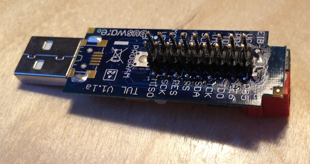
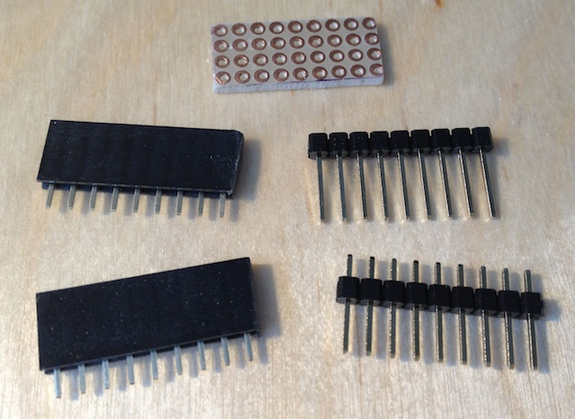
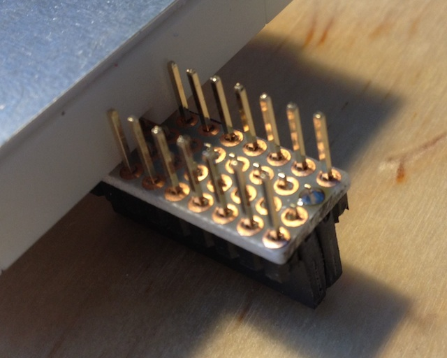
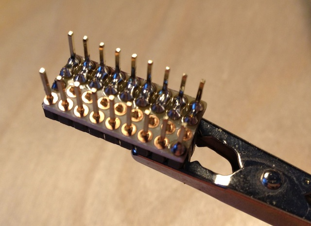
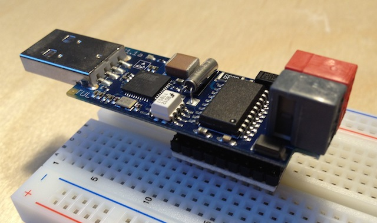

Currently i am testing with a small Prototype Board [TUL - TPUART USB light](http://busware.de/tiki-index.php?page=TUL) with a Atmel AT 32U4 Controller and a Siemens TP-UART Chip for KNX access.

For expansion, this board has a 9x2 Pinheader which is not directly compatible with a breadboard.

<!-- more -->

After testing a bunch of different solutions, i came up with a small, very fast assembled Adapter from Pinheaders to Breadboards.

This solution is also feasible for a lot of other Breadboard interface needs.

As a first step, prepare the parts:

* perfboard 9x4 holes
* 2 Socket Strips 9x1 (or one 9x2)
* 2 Pinheader 9x1 (upper one already prepared for soldering)

The pins of the 9x1 Pinheader must pe pushed entirely to one side (see the upper one on the photo).

For soldering the first solder points it is very helful to fix everything in a breadboard.

The solder points between the header and the socket are connect while soldering.

Mission accomplished.

Uwe says

2014/01/03

This article was mentioned in a <a href="https://hackaday.com/2012/11/15/hackaday-links-november-15-2012/">Hackaday Links Post</a>.

