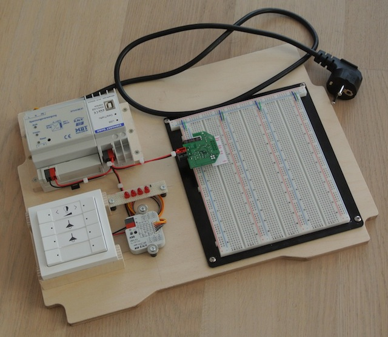
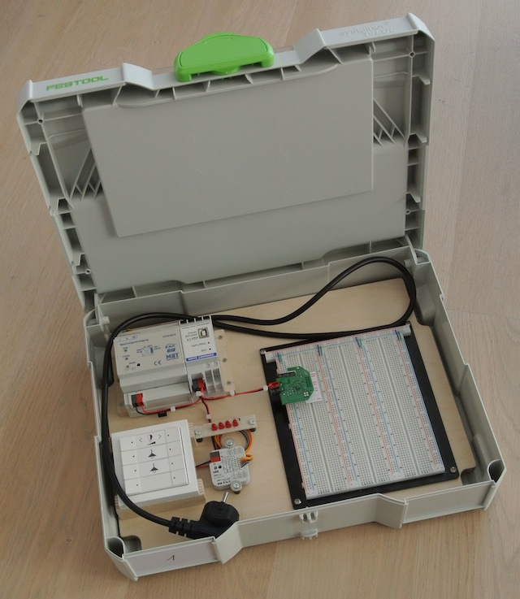
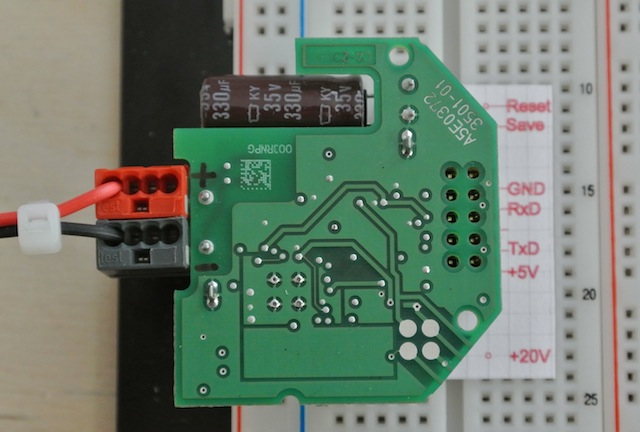

+++
title = "Testbed for KNX devices"
date = 2012-11-30
[taxonomies]
categories = ["homeautomation"]
[extra]
shortlink = "4291d22a"
+++

For creating my [RoomSensor](roomsensor) i have build a testbed for KNX Devices.

<!-- more -->

It consists of:

* MDT 160 mA KNX power supply
* eibmarkt USB to KNX interface
* Busch Jaeger
* ABB 4
* TPUART2 Evaluationboard

The base board is designed to fit into an Systainer Size 1. This has the advantage that i can take the testbed with me and use it also for [openhab](http://www.openhab.org) demos.

If you like to mill a base board for a Systainer Size 1, you can get the Rhino 3D [drawing](EinlageSystainer.3dm), of the exported [dxf](PlatteSystainer.dxf).

It is also the first time i have created a label for the pins used on the TPUART2 evaluation board. You can get the Rhino 3D [drawing](PinOut.3dm)
here and use it as a base for your own labels.

The connection between the evalboard and the breadboard is done by one of my [breadboard adapters](pinheader-breadboard-adapter).

