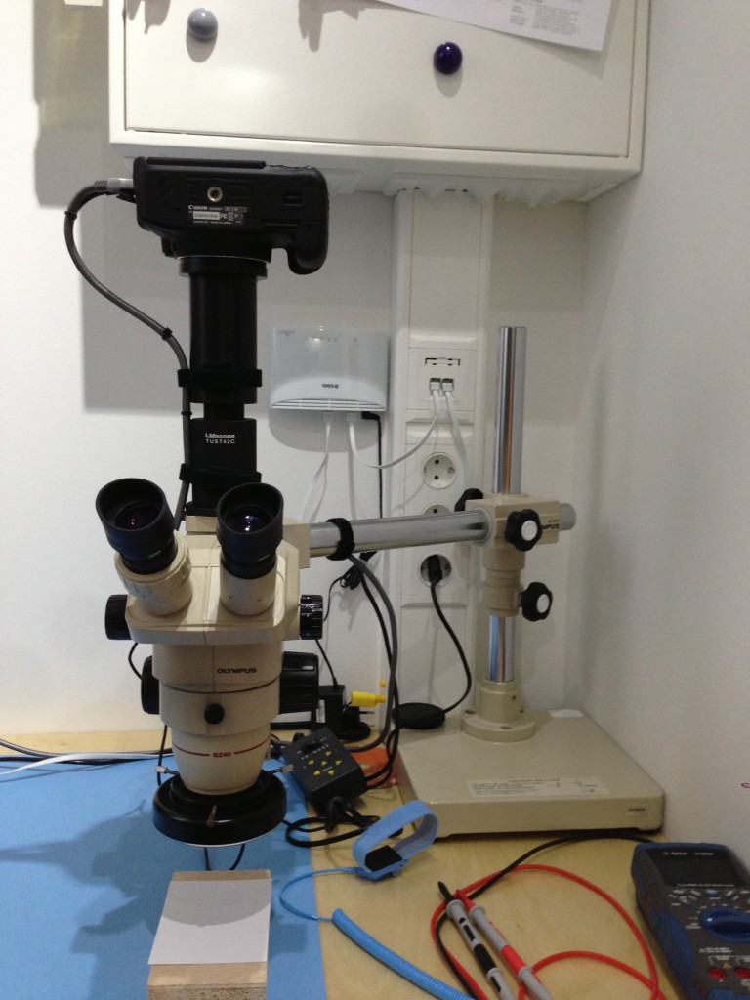
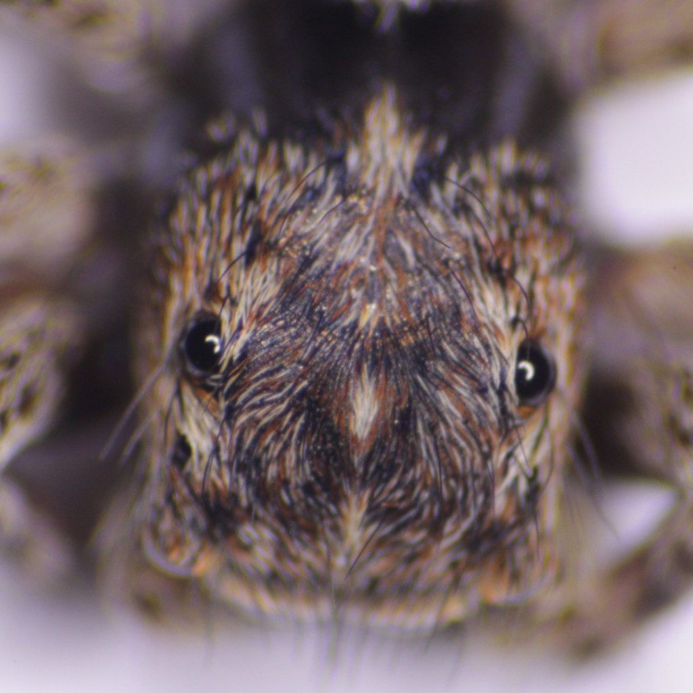
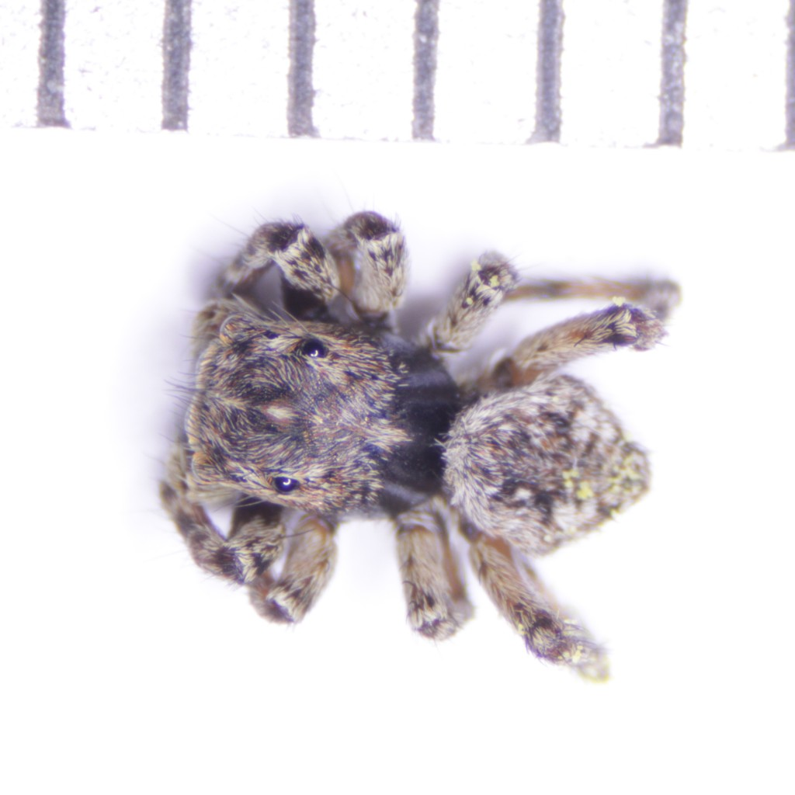
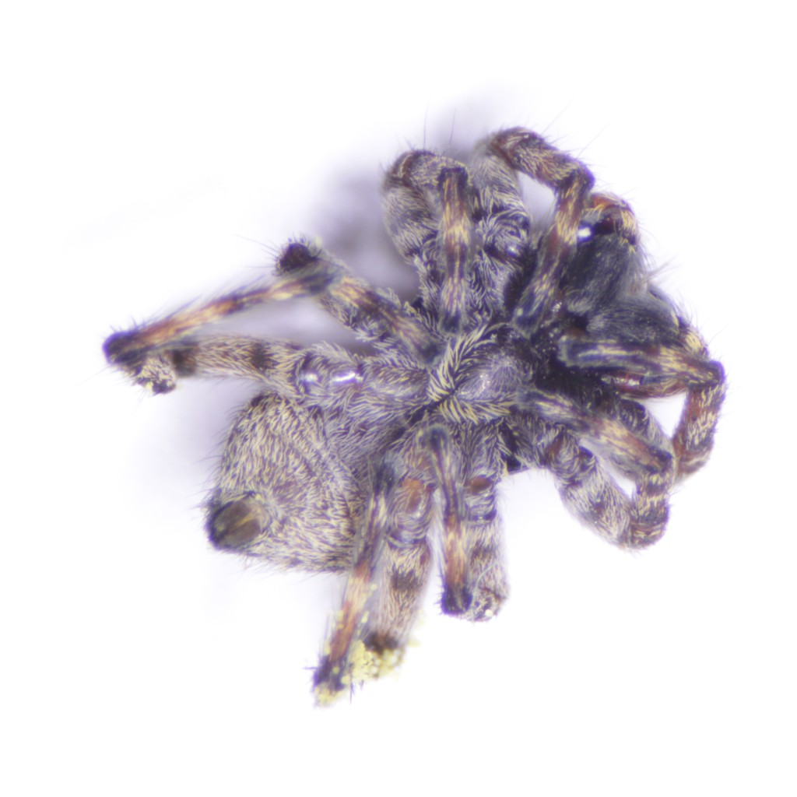
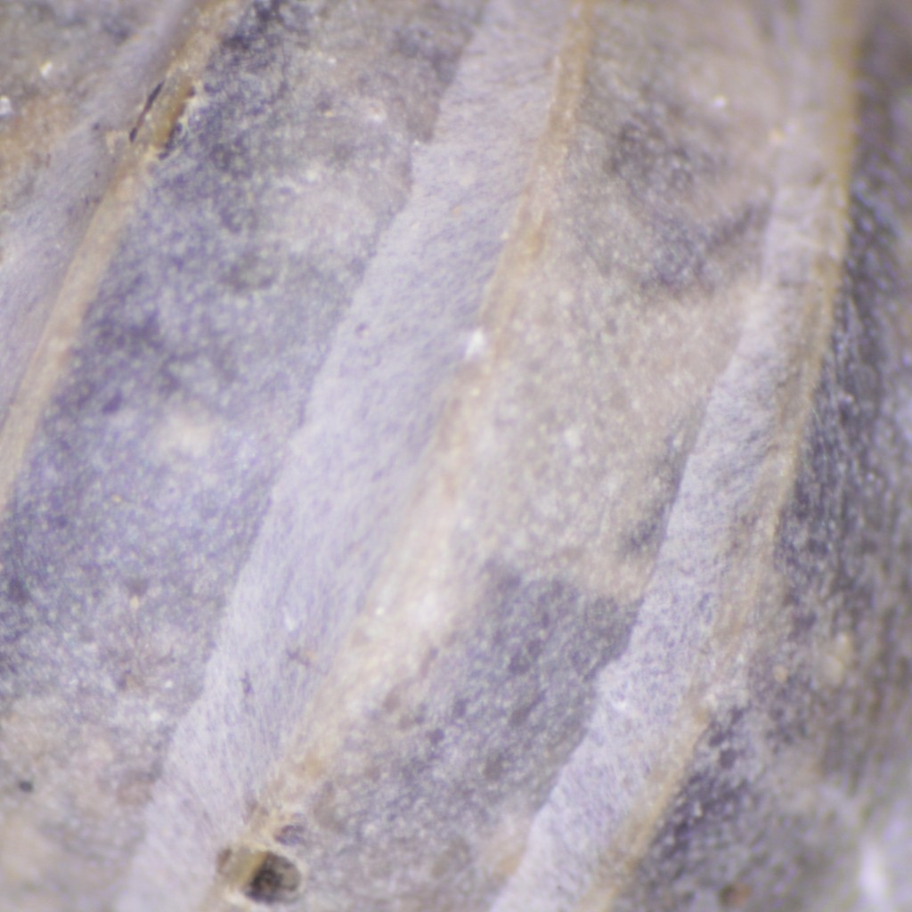
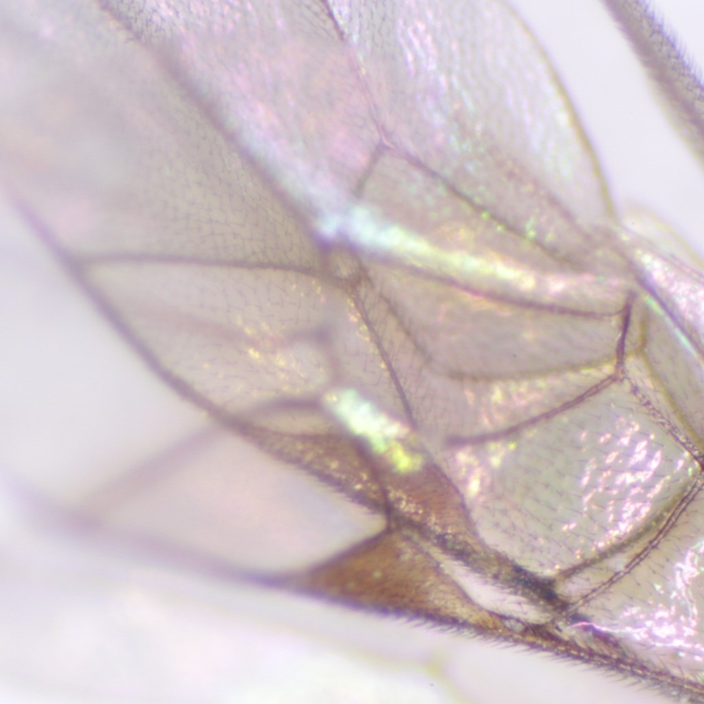
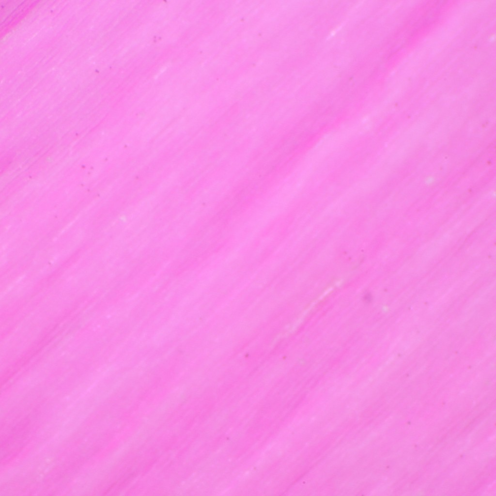
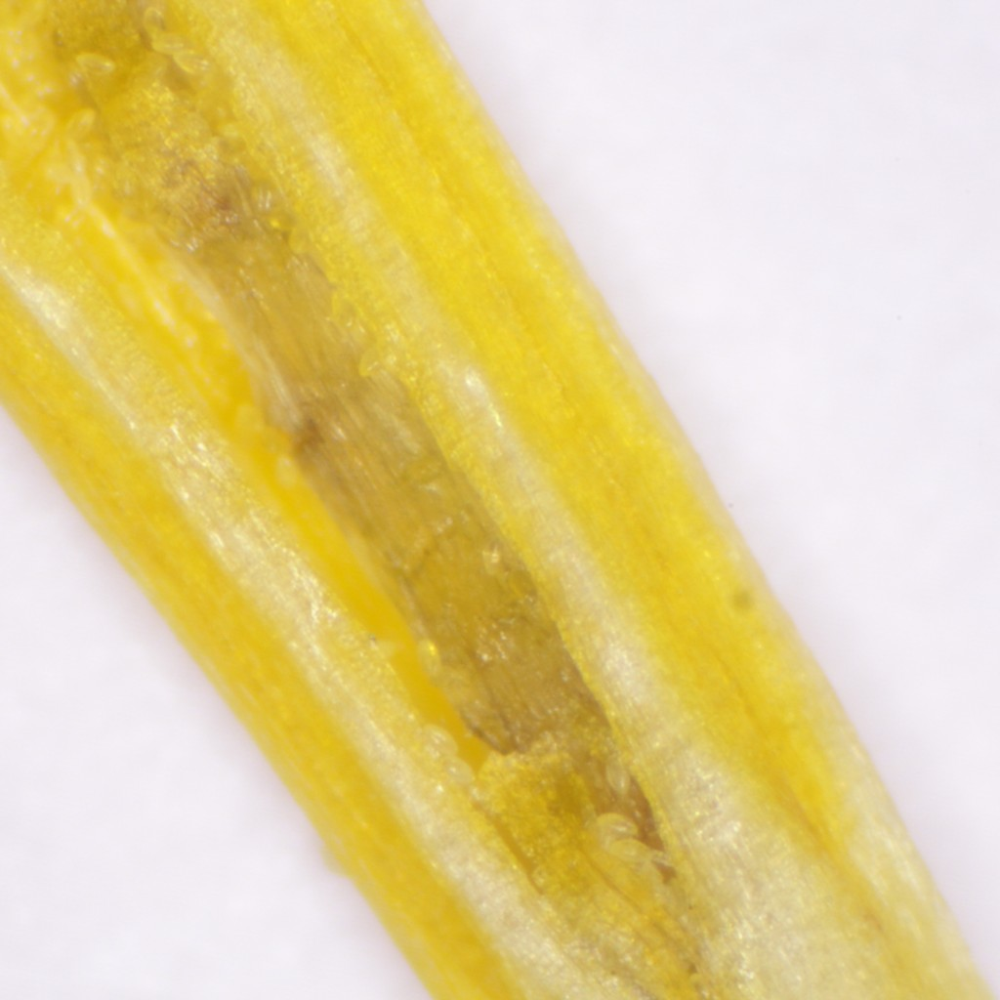

extends: post.liquid

title: Olympus SZ4045TR Stereo Microscope
date: 22 Mar 2013 00:00:00 +0100
type: "blog"
categories: ["Other"]
---

Recently i have bought a Olympus SZ4045TR Stereo Microscope. I will use it for all
kind of electronics SMD stuff.

<!-- more -->

But because our goddaughter visited us last week, the first things under the
microscope where a small spider, a dead fly and some flower parts, but see yourself...

## Microscope

## Spider

<!-- more -->

4mm size

## sowbug

## fly wing

## flower parts

