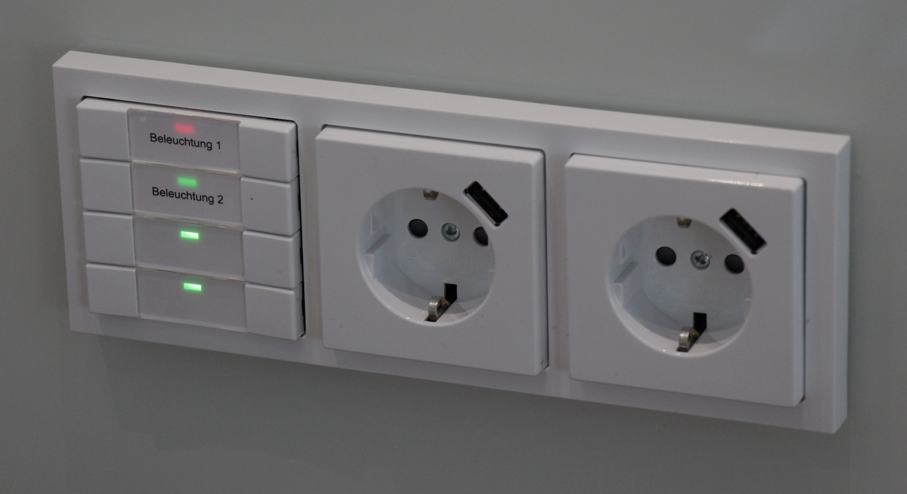

extends: post.liquid

title: Wall outlet with USB plug
shortlink: 423dbf84

date: 07 Apr 2013 00:00:00 +0100
type: "blog"
categories: ["Home Automation"]
---

[Busch Jaeger](http://www.busch-jaeger.de) sells now wall outlets with integrated USB plugs for charging up your iPhone or every other USB device.

<!-- more -->

The only disadvantage is that the depth of the cover is not the same as a "standard" wall outlet, so you can not mix them.
