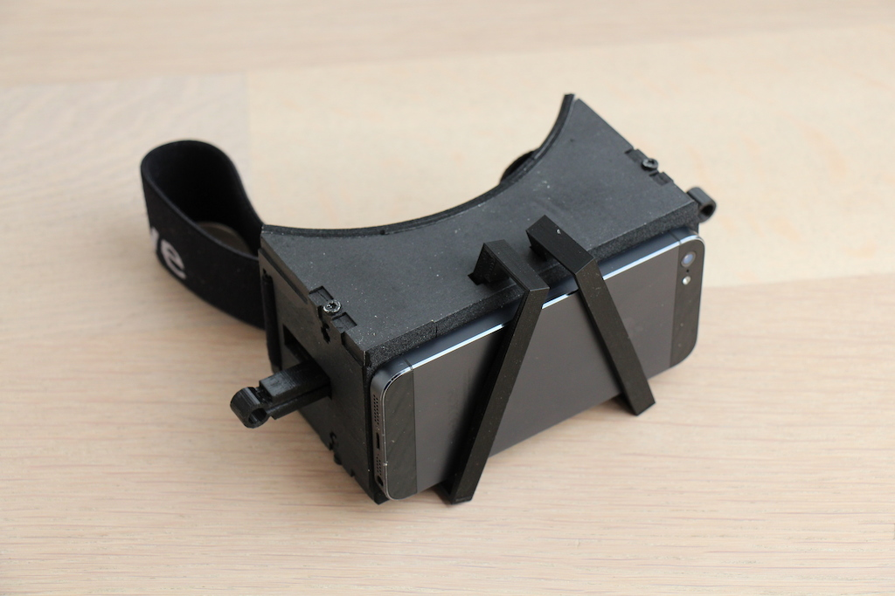
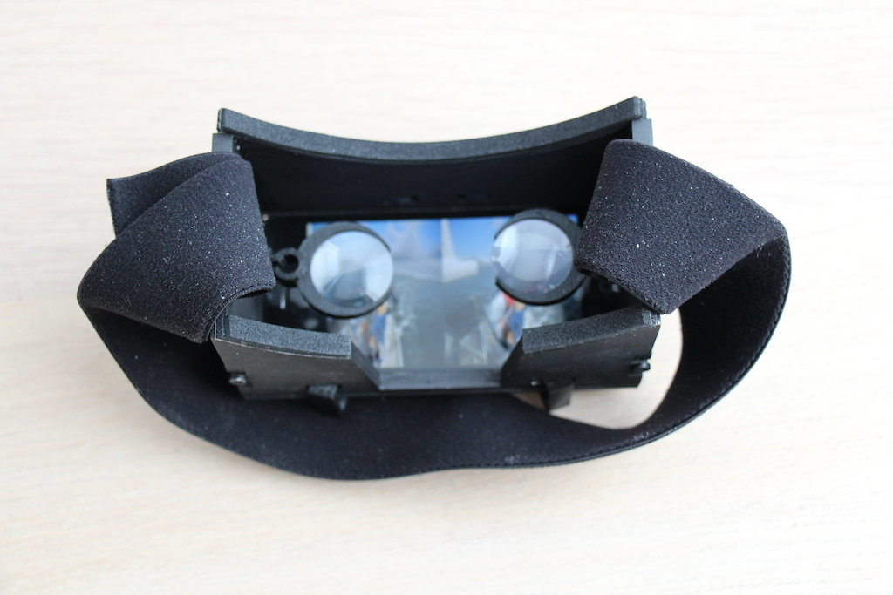
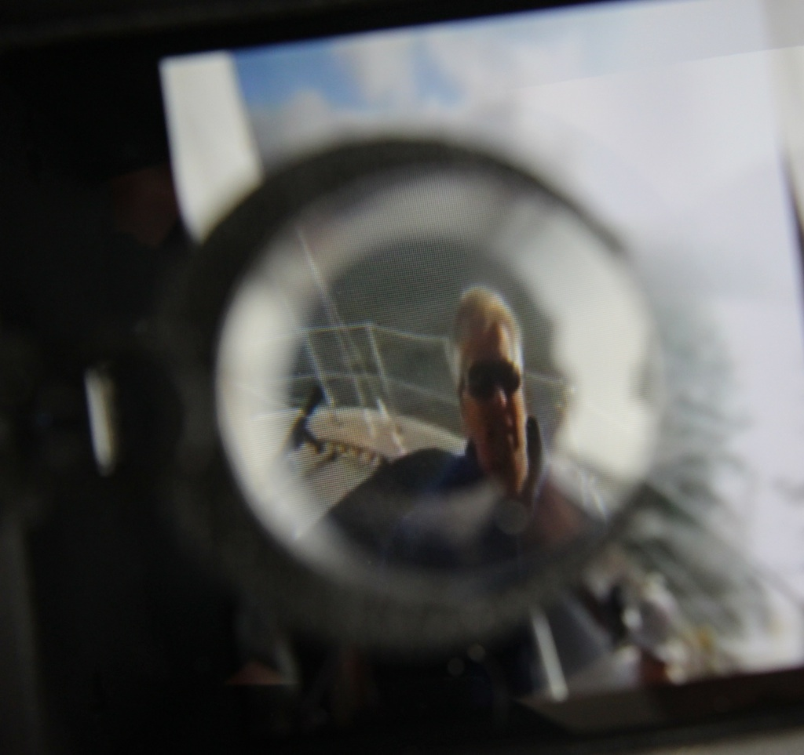

title: Durovis Dive and iPhone
categories:
  - iOS
  - Other
published_date: "2013-08-15 00:00:00 +0100"
layout: post.liquid
data:
  type: blog
  shortlink: 426ceea1
---
I have built a [Durovis Dive](http://www.durovis.com) to test if it works with a iPhone 5 too.

It is a not complete 3D print, instead i used the laser cut parts [Lasercut Opendive](http://wiki.fablab-nuernberg.de/w/Ding:opendive) from Fablab Nürnberg.

<!-- more -->

The iPhone 5 fits perfect:

At the moment, i use it for 3D Videos, Downloaded from (mostly) [Youtube 3D](http://youtube.com/3d) and displayed with
[VLC for iOS](https://itunes.apple.com/de/app/vlc-for-ios/id650377962?mt=8):

Hopefully i will find time to create a program to Display 3D models from Rhino 3D anytime soon.

The plastic lenses from Durovis do not have the highest optical quality, but they work perfectly together with the iPhone5:

