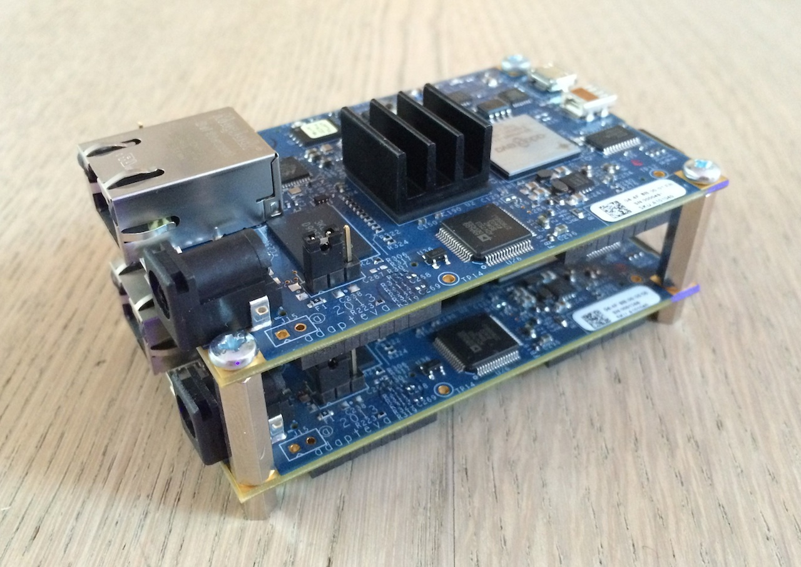

extends: post.liquid

title: "Parallella Boards"
date: 10 Apr 2014 00:00:00 +0100

type: "blog"
categories: ["Other"]
---

I've got my two [Parallela](http://www.parallella.org) Boards from the [Parallella Kickstarter Campaign](https://www.kickstarter.com/projects/adapteva/parallella-a-supercomputer-for-everyone).

<!-- more -->

So far i have only installed Ubuntu on the two boards and run some sample programs. Looks like they have quite impressive performance.

