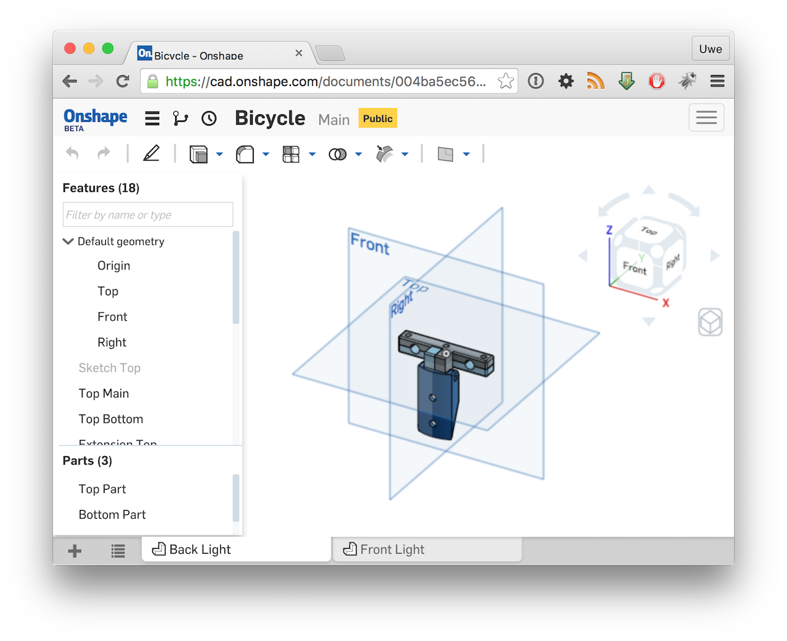
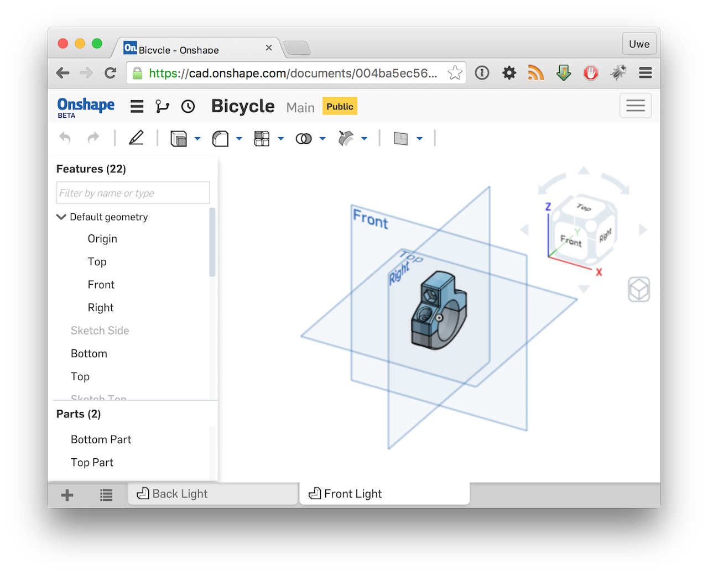

title: Redrawn Bicycle Parts in Onshape
categories:
  - Other
published_date: "2015-09-16 00:00:00 +0100"
layout: post.liquid
data:
  shortlink: 42eb9149
  type: blog
---
Recently i stumbled over the Online CAD [Onshape](https://www.onshape.com). I immediately fell in
love, because it is browser based (so it can easily be used on Macs and Linux) and it is free
for public models (and a small number of private models too).
It is a parametric CAD tool, so it is more in the Solidworks range than in the Rhino3D area.

After some testing, i decided to redraw some existing parts, to spot differences how i develop parts
with my Rhino3D package.

To summarize everything up: I love it, i will use it in the future and it gives me a perfect
Reason for buying a iMac Retina and a iPad Pro.

Here screenshots from the two models which you can also
[access](https://cad.onshape.com/documents/004ba5ec56454e8db5af3c86) online. As a downside you 
have to create a (free) account first, there is no way for i.e. embedding the model in my website 
at the moment.

<!-- more -->

 

 
