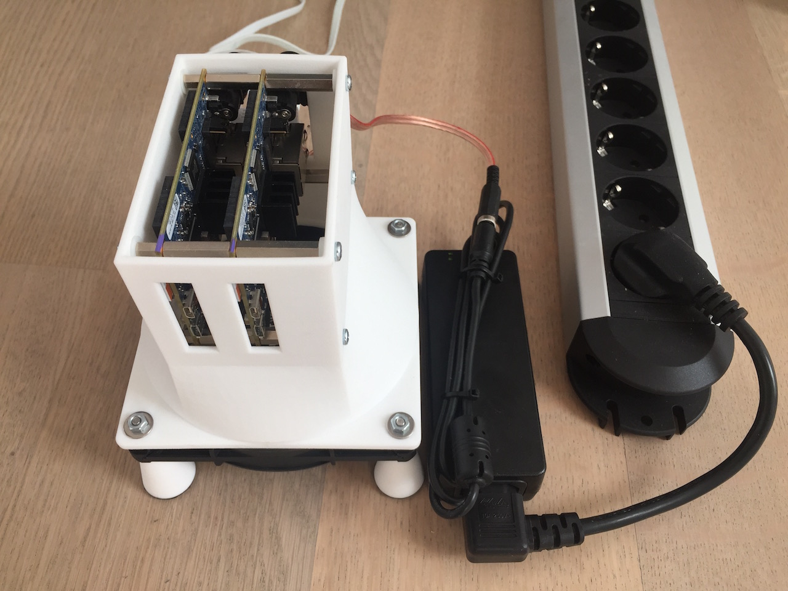
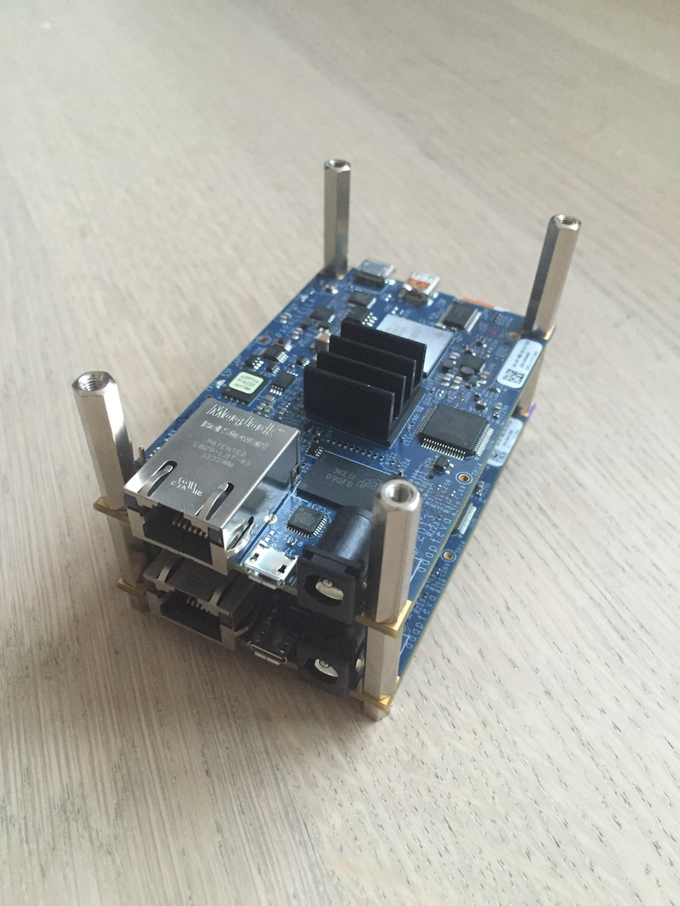
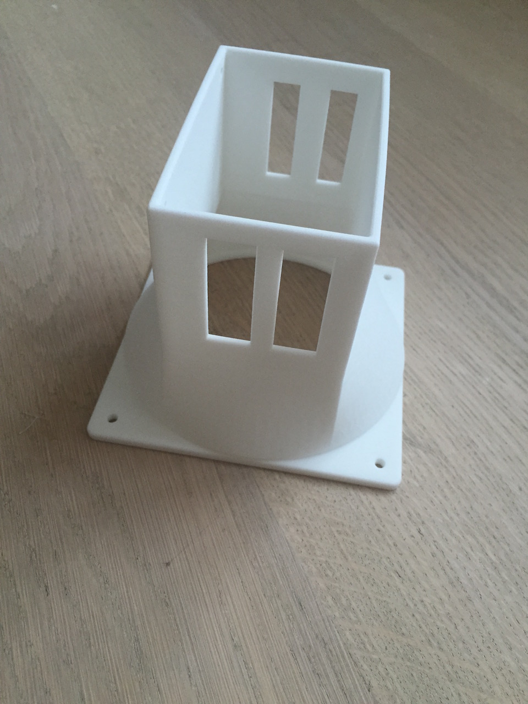
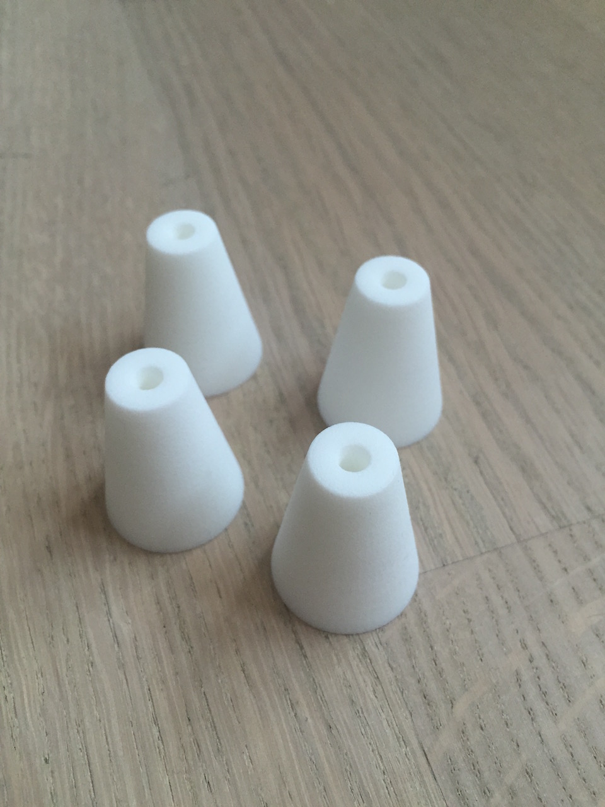
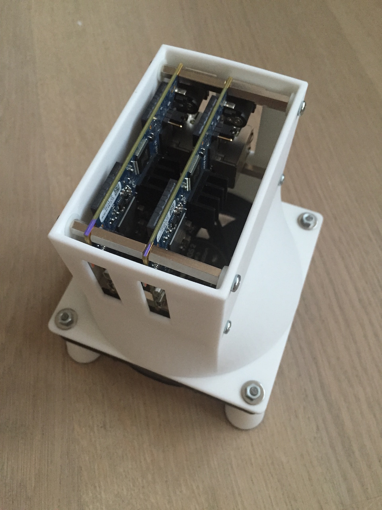
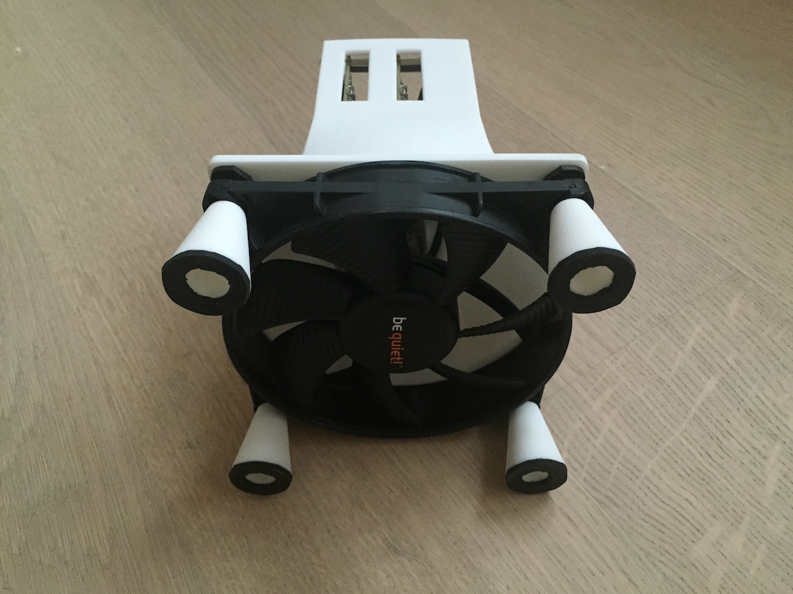

extends: post.liquid

title: "Parallela on supercomputer.io"
date: "2015-10-03"
date: 03 Oct 2015 00:00:00 +0100

type: "blog"
categories: [ "Other" ]
---

[Parallela](https://www.parallella.org) has started a distributed Supercomputer on 
[supercomputer.io](http://supercomputer.io) with their parallela chips. I decided to
put my two Kickstarter Parallelas inside a cooling case and let them participate.

<!-- more -->

If you like to build your own, you can print the STL files

   * [Air Channel](AirChannel.stl)
   * [Standoff](Standoff.stl) (4 times)

or you can get the CAD files from 
[Onshape](https://cad.onshape.com/documents/4d995dc0d7024fd28425b2d3/w/84a63ad9c1bf4490b28853c7/e/1d542ccd0648408ba0a536f5)
and change it according to your needs.

# Assembling

Boards mounted with spacers.

The Air channel as delivered from Shapeways.

The standoffs as delivered from Shapeways.

Everything mounted together.

View from the bottom with the (quiet) fan.
