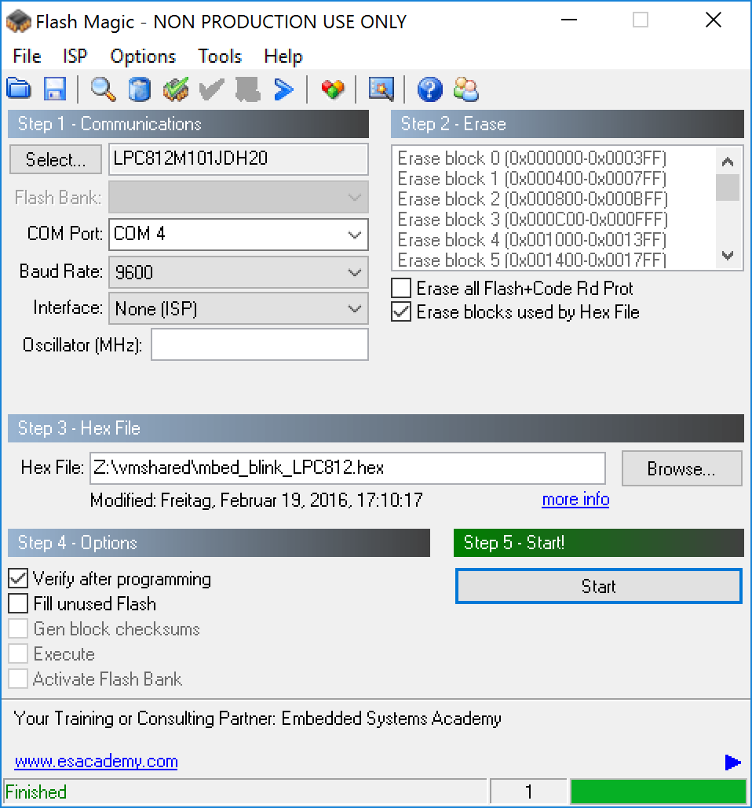
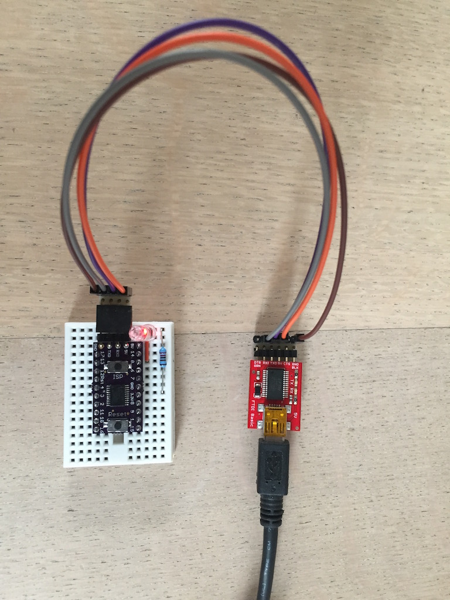

I have build some of the small [LPC800](https://github.com/cpldcpu/LPC812breakout) Breakout
Boards.

To program them with the online [mbed](https://os.mbed.com) compiler,
the resulting bin files have to be changed with the following command:

```bash
arm-none-eabi-objcopy -I binary -O ihex mbed_blink_LPC812.bin mbed_blink_LPC812.hex
```

The [arm compiler](https://launchpad.net/gcc-arm-embedded) toolchain should be installed in your path.

<!-- more -->

Here a small sample program for blinking an LED:

```cpp
#include "mbed.h"

DigitalOut LED(P0_0);

int main(int argc, char* argv[]) {
  while(true) {
        wait(0.5);
        LED = !LED;
  }
}
```

You can program the resulting hex file with [FlashMagic](http://www.flashmagictool.com)
and a USB to serial Adapter.

I use FlashMagic on Windows(inside a virtual machine), because on Mac OS X the installation
of XQuartz is required.



and the result:


