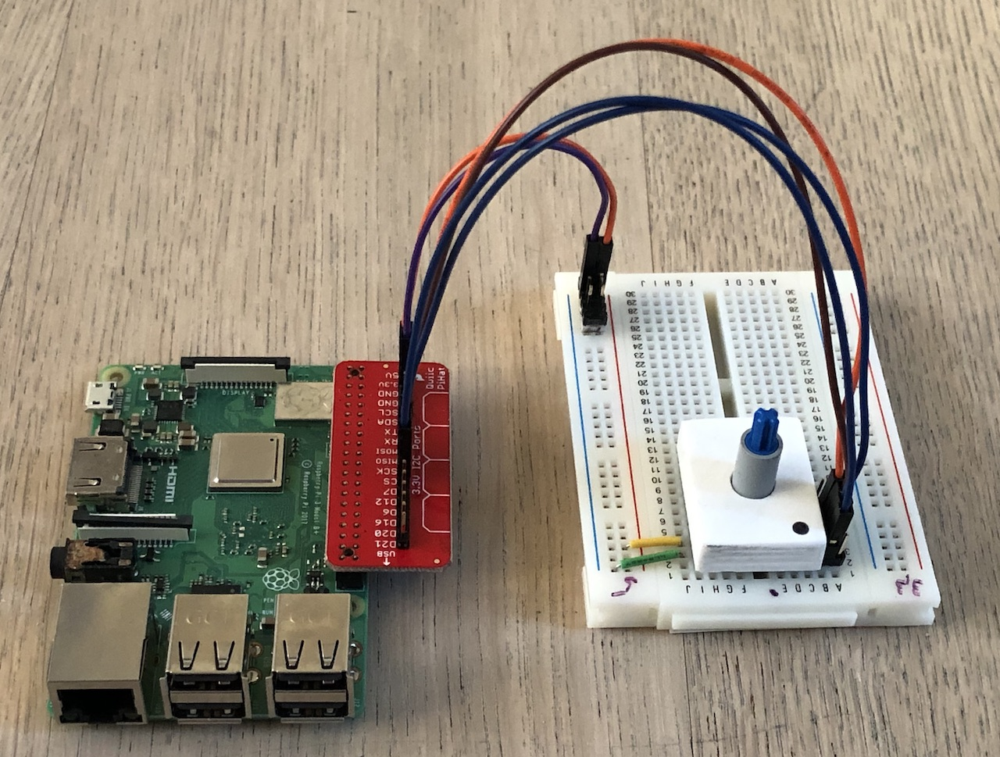
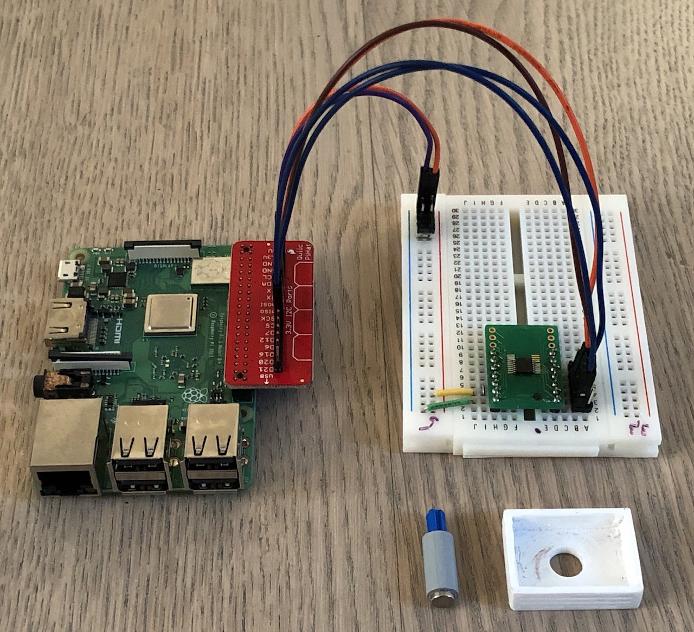

there is now a driver for the AMS AS5048A
[crates.io](https://crates.io/crates/as5048a) / [github](https://github.com/uwearzt/as5048a).

It uses the [embedded_hal](https://crates.io/crates/embedded-hal), here is my test setup

<!-- more -->





It uses the

* [Sparkfun Qwiic Hat](https://www.sparkfun.com/products/14459)

* a simple SMD to DIL converter board together with a 3d printed cover. You can download the
  cover as ready to print [STL](as5048.stl), or copy the Fusion 360 [part](https://a360.co/2Eg3loC).
  The test axis with a magnet consists of two Lego parts.

## Example output

```bash
diag: 00000001 gain: 50
magnitude: Ok(4713)
angle: Ok(15814)

diag: 00000001 gain: 50
magnitude: Ok(4655)
angle: Ok(15988)

diag: 00000001 gain: 53
magnitude: Ok(4542)
angle: Ok(1271)
```