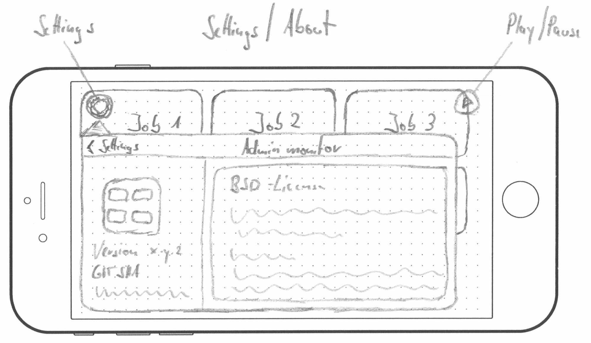

title: AdminMonitor
layout: default.liquid
data:
  shortlink: 4215543e
---
# Overview

## Specification

   * Automatically switching between different Web Views
   * Reloading if changes are not pushed by server
   * Switching can be paused
   * Prefers https over http
   * Runs on iOS and tvOS
   * BSD License and AppStore

## UI Design

# Screenshots

# Tips and Tricks

# Get it

## Download from AppStore

## Compile it
