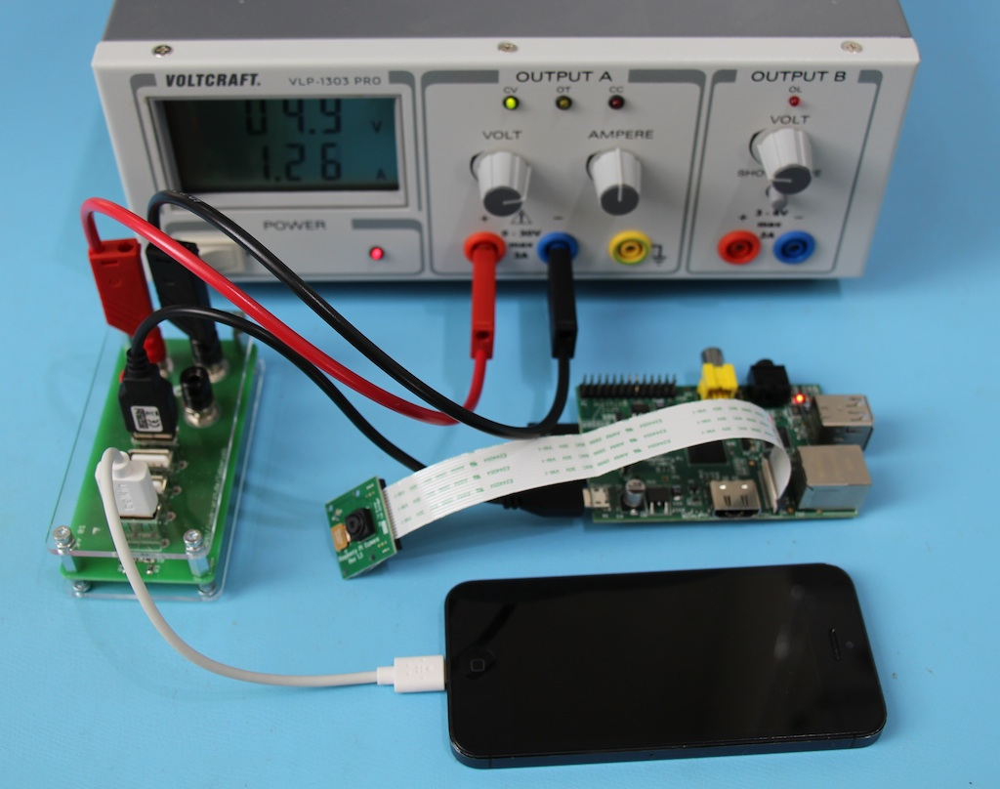

extends: default.liquid

title: LaborUSB
shortlink: 42b67912
project_url: https://github.com/uwearzt/LaborUSB.git
---

Many prototyping boards these days use USB Connectors as Power Source. For easy powering those devices with my DC Power Supply (or in german "Labornetzteil") i created a adaptor from 4 mm banana plugs to 4 USB Jacks.

Additional benefit is that all types of iThings can be loaded with the Adaptor. The necessary research for loading Apple devices was done by [Adafruit](http://www.adafruit.com), see their page about [icharging](http://learn.adafruit.com/minty-boost/icharging).

The device in action:

Find all the files necessary to build your own on [GitHub](https://github.com/uwearzt/LaborUSB.git).

I have a few boards available, if you like to build your own, contact me.

<!-- more -->

## Design

### Schematic

The design is really simple and consists of only 4 resistors and 8 jacks. The real work was to make the mechanical dimensions fit for easy and fast assembly.

### Board

Can be easily done by every board house.

## Bill of materials

<table>
	<thead>
		<tr><th>Count</th><th>Description</th><th>Source</th></tr>
	</thead>
	<tbody>
		<tr><td>2</td><td>Through-hole banana jack Black</td><td><a href="http://www.reichelt.de">Reichelt</a></td></tr>
		<tr><td>2</td><td>Through-hole banana jack Red</td><td><a href="http://www.reichelt.de">Reichelt</a></td></tr>
		<tr><td>1</td><td>Resistor 43K 0805</td><td><a href="https://www.distrelec.de">Distrelec</a></td></tr>
		<tr><td>1</td><td>Resistor 75K 0805</td><td><a href="https://www.distrelec.de">Distrelec</a></td></tr>
		<tr><td>2</td><td>Resistor 51K 0805</td><td><a href="https://www.distrelec.de">Distrelec</a></td></tr>
		<tr><td>4</td><td>USB Jack</td><td><a href="https://www.distrelec.de">Distrelec</a></td></tr>
		<tr><td>1</td><td>Laser cut Front panel 3mm thick</td><td><a href="http://www.formulor.de">Formulor</a></td></tr>
		<tr><td>1</td><td>Laser cut Back panel 3mm thick</td><td><a href="http://www.formulor.de">Formulor</a></td></tr>
		<tr><td>4</td><td>Nuts 6mm Fine Pitch Thread</td><td></td></tr>
		<tr><td>4</td><td>Screws M3 * 6mm</td><td></td></tr>
		<tr><td>4</td><td>Screws M3 * 10mm</td><td></td></tr>
		<tr><td>4</td><td>Hex Standoffs M3 * 12mm without Thread</td><td></td></tr>
		<tr><td>4</td><td>Hex Standoffs * 5mm with Thread</td><td></td></tr>
	</tbody>
</table>

## Assembly

### Solder Resistors

### Prepare Front Panel

Place the banana jacks in the front panel and secure them with the additional 6mm fine thread nuts. Add one of the delivered 6mm fine thread nuts to every banana plug.

Add the 12mm standoff to the front panel with the M3 10mm screws. If you do not have 12mm standoffs, it is possible to replace the 12mm standoffs with a 10mm standoffs and a additional nuts.

### Add board to front panel

Place the board on the 12 mm standoff and secure it with the 5mm standoffs.

Screw the 6mm nut up until the board is reached.

Take the remaining 6mm fine threaded nuts and secure the banana plugs on the board.

### Add USB Jacks

With the USB jacks from Reichelt, you need to first straighten the outer pins as seen on the left jack. Otherwise they will not fit through the front panel.

Place all 4 USB Jacks in the front panel and solder them to the board.

### Add back panel

Use the 4 M3*6 screws and screw the backpanel in place.
